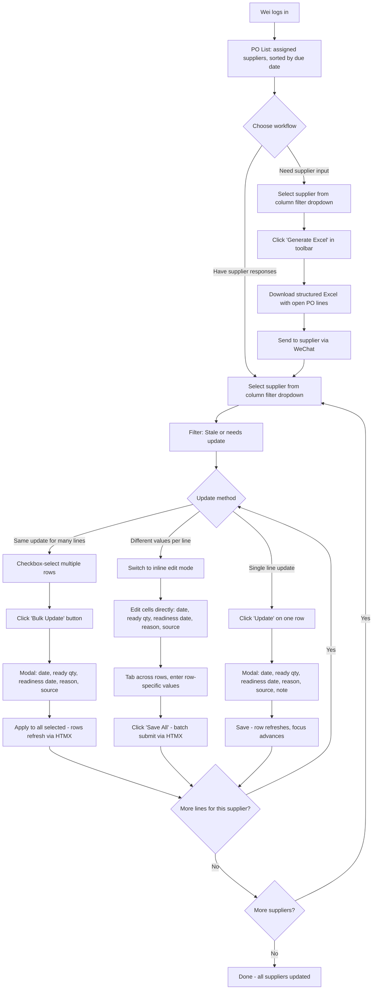
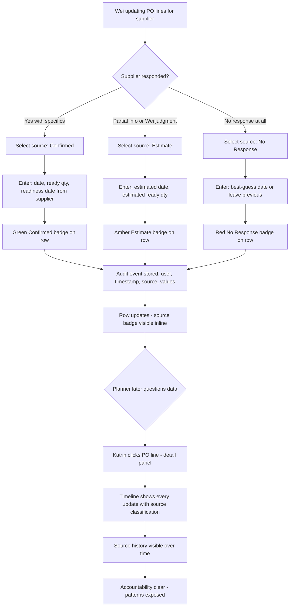
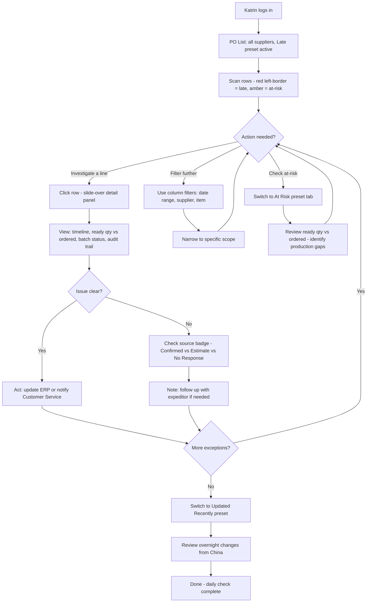
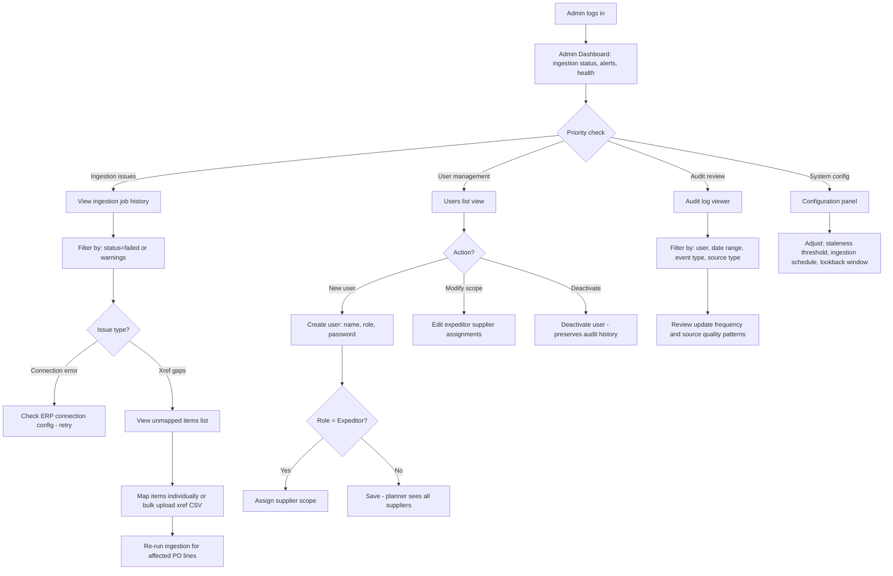
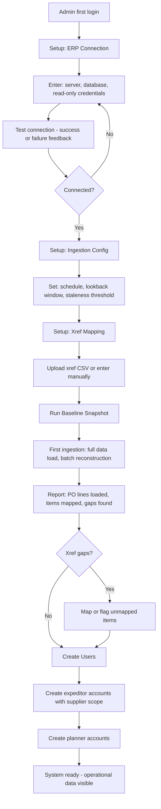

# UX Design Specification PO_Tracking

**Author:** J.maliczak
**Date:** 2026-02-12

---

## Executive Summary

### Project Vision

PO Timeline & Batch Tracker replaces an Excel-based PO tracking workflow between expeditors in China and planners in Europe with a structured, audit-grade web application. The core UX mission is to transform a weekly manual data compilation cycle into an always-current, exception-driven operational interface that serves two distinct user mindsets — data producers (expeditors) and data consumers (planners) — through role-appropriate views built on shared, trustworthy data.

### Target Users

**Expeditor "Wei" (x3, China-based)** — Primary data producer. Manages 30 suppliers, communicates via WeChat, works under time pressure. Currently spends 50%+ of each week on manual Excel compilation. Needs fast structured data entry, bulk supplier request generation, and clear visibility into what still needs updating. Basic English proficiency; UI must be simple and icon-supported.

**Planner "Katrin" (x3, Europe-based)** — Primary data consumer. Relies entirely on expeditor-provided data with a 6-8 hour timezone offset. Currently searches through thousands of Excel rows to find exceptions. Needs exception-first dashboards, self-service PO investigation with full audit context, and confidence that the data is current and sourced.

**Admin "J.maliczak" (Europe-based)** — System builder and operator. Needs ingestion monitoring, user/role management, xref mapping tools, and audit log analysis. Intermediate technical skill level.

**Management (Europe-based, Phase 2)** — Read-only KPI consumers. Deferred to Phase 2; MVP focuses on building the operational data foundation.

### Key Design Challenges

1. **Dual-workflow UI** — Expeditors produce data; planners consume it. The same PO dataset must serve both through role-appropriate views, navigation patterns, and default filters without maintaining two separate interfaces.

2. **Cross-timezone data trust** — Every data point must carry visible provenance (who, when, source quality). The UI must communicate freshness and reliability at a glance across a 6-8 hour timezone gap.

3. **High-density operational data** — Up to 5,000 active PO lines with rich column data. The transition from Excel must feel like a gain in scanning speed and exception detection, not a loss in information density.

4. **Source quality as visual language** — Mandatory source classification (Supplier confirmed / Expeditor estimate / No supplier response) must be visually distinct and consistently applied across all views without becoming noise.

5. **English UI for non-native speakers** — Clear, short labels and icon-supported actions to minimize language friction for Chinese expeditors using an English interface.

### Design Opportunities

1. **Exception-first dashboard** — Smart default views showing only what needs attention (late, at-risk, stale, recently changed) can deliver immediate value over the Excel workflow for planners.

2. **Faster-than-Excel data entry** — Structured milestone recording with minimal clicks, smart defaults, and inline patterns can make the most repeated expeditor action genuinely faster than the current Excel process.

3. **Audit timeline as trust engine** — A clean chronological PO timeline with source and reason annotations resolves cross-timezone ambiguity and builds the accountability culture the organization needs.

## Core User Experience

### Defining Experience

PO_Tracking has two core loops that define its value:

**Expeditor loop (write-heavy):** Open app → filter to supplier → update PO lines in rapid succession → generate supplier request Excel → move on to real expediting work. The critical interaction is milestone recording: date + reason + source in minimum possible steps.

**Planner loop (read-heavy):** Open app → scan exception dashboard (late, at-risk, changed) → drill into PO detail for full timeline and batch context → act on the information. The critical interaction is exception detection: seeing what needs attention without manual filtering.

The single interaction that determines product success is the expeditor's PO line update cycle. If recording a milestone is faster and more structured than updating an Excel cell, adoption follows. If it's slower, the tool fails.

### Platform Strategy

- Desktop-first web application at 1280px+ primary viewport
- Server-rendered pages with progressive enhancement (Django + HTMX)
- Mouse and keyboard as primary input — dense data tables with keyboard-navigable entry
- Tablet (768-1279px) as responsive secondary target — functional but not touch-optimized
- No offline capability required — operational tool used during business hours with network connectivity
- No native device features needed — pure browser-based experience
- Edge and Chrome as primary browsers; Firefox secondary; 360 Secure Browser best-effort

### Effortless Interactions

- **Exception presets** — late, at-risk, stale, recently updated views are one-click filter presets, not manually constructed queries. The default view is already filtered to what matters.
- **Rapid milestone entry** — update a PO line without full page navigation. Inline editing or lightweight modal keeps the user in list context for rapid successive updates.
- **Supplier Excel generation** — select supplier(s), generate structured request file, send. Replaces the manual download-split-format cycle entirely.
- **Self-service investigation** — click any PO line to see the full audit timeline, batch history, and status transitions. No cross-referencing files or asking colleagues across timezones.
- **Smart defaults** — role-appropriate default filters, sort orders, and visible columns reduce setup to zero for the most common daily workflow.

### Critical Success Moments

1. **Wei's first Monday** — opens the app, sees a prioritized supplier workload instead of a raw Excel dump, generates request files before lunch. The moment the tool proves it's faster.
2. **Katrin's first morning** — opens the dashboard to 5 flagged delayed POs with reasons attached. No digging through thousands of rows. Immediate actionability.
3. **First accountability resolution** — a planner asks "why is this late?" and the full answer (who reported, when, what source, what reason) is one click away in the audit timeline. Cross-timezone trust established.
4. **Expeditor rapid-fire session** — Wei updates 15 PO lines for one supplier in under 10 minutes using structured entry with smart defaults. The moment Excel feels obsolete.

### Experience Principles

1. **Exceptions first, completeness second** — default views surface what needs attention. Full data is accessible but never the starting point. Users should see their work queue, not a data dump.
2. **Entry speed over entry richness** — mandatory fields only (date, reason, source) for the most repeated actions. Keep milestone recording to minimum viable friction. Additional context (notes, comments) is available but never blocking.
3. **Provenance is always visible** — who updated, when, and source quality (confirmed / estimate / no-response) are displayed inline across all views. Trust is built into every data display, not hidden in a detail panel.
4. **One app, role-shaped views** — shared data and navigation structure, filtered and weighted by role. Expeditors see their supplier scope with action-oriented defaults. Planners see all suppliers with investigation-oriented defaults. No separate interfaces to maintain.
5. **Familiar density, smarter structure** — respect the information density that Excel power users expect, but add what Excel cannot: persistent filtering, exception flagging, sortable columns, audit trails, and structured input validation.

## Desired Emotional Response

### Primary Emotional Goals

1. **Confidence** — "I can trust this data." Users must feel certain about data accuracy, currency, and provenance. Every interaction reinforces that the system is the single source of truth, not a black box.
2. **Efficiency** — "I'm getting through my work faster." The quiet satisfaction of a tool that removes friction from repetitive operational tasks. Not consumer delight, but professional flow.
3. **Control** — "I can see what needs my attention and act on it." Users feel they are driving the workflow, not drowning in it. Exceptions are surfaced; the work queue is clear.

### Emotional Journey Mapping

| Stage | Expeditor (Wei) | Planner (Katrin) |
|-------|----------------|-----------------|
| **Opening the app** | Relief — work queue is clear, not a wall of data | Confidence — overnight changes are visible immediately |
| **Core action** | Flow — rapid-fire updates feel efficient, not tedious | Clarity — exceptions are obvious, investigation is self-service |
| **After completing task** | Accomplishment — "done by Tuesday, not Thursday" | Preparedness — "I know what to act on today" |
| **When something goes wrong** | Supported — clear validation feedback, not cryptic errors | Trust preserved — problems are visible and traceable |
| **Returning next day** | Familiarity — "I know exactly where I left off" | Currency — "the data is fresh, the world makes sense" |

### Micro-Emotions

**Critical positive states to cultivate:**
- **Trust over skepticism** — provenance on every data point eliminates "is this current?" doubt
- **Accomplishment over frustration** — visible progress through the work queue (X of Y updated)
- **Confidence over confusion** — clear, short labels with icon support for non-native English speakers
- **Familiarity over disorientation** — consistent layouts, persistent state, Excel-like density

**Negative states to prevent:**
- **Overwhelm** — too much data, no structure, no starting point (the Excel problem)
- **Doubt** — invisible provenance or stale data without indicators
- **Tedium** — milestone entry that feels like more work than the Excel it replaces
- **Confusion** — unclear labels, ambiguous icons, or jargon in an English UI for non-native speakers

### Design Implications

| Target Emotion | Design Approach |
|---------------|----------------|
| Confidence | Inline provenance (who/when/source) on every data point. Audit timeline one click away. Source quality badges visible in list and detail views. |
| Efficiency | Inline or modal milestone entry without page navigation. Smart field defaults. One-click filter presets. Minimal mandatory fields. |
| Control | Exception-first default views. Clear work queue with progress indicators. Role-scoped data so users see only what's relevant. |
| Relief | Progressive disclosure — summary list first, detail on demand. Role-appropriate defaults eliminate manual setup. |
| Familiarity | Consistent table-based layouts. Persistent filter and sort state across sessions. Information density that respects Excel power-user expectations. |

### Emotional Design Principles

1. **Trust is earned per-pixel** — every data point that lacks visible provenance erodes confidence. Default to showing who/when/source, not hiding it.
2. **Speed is the primary delight** — in an operational tool, the emotional reward is finishing faster. Every unnecessary click or page load is an emotional cost.
3. **Structure reduces anxiety** — structured input with clear validation prevents the fear of "did I do this right?" that free-form Excel creates.
4. **Visibility creates calm** — when users can see the full picture (work queue, progress, exceptions, audit trail), anxiety about the unknown disappears.
5. **Consistency builds comfort** — predictable layouts, persistent state, and familiar patterns let users operate on autopilot for routine tasks.

## UX Pattern Analysis & Inspiration

### Inspiring Products Analysis

**Jira / Linear (Issue tracking)** — Filter presets as first-class navigation, inline status transitions from list view, persistent filter state across sessions, keyboard shortcuts for power users. Relevant for the expeditor rapid-fire update pattern and planner exception preset model.

**Airtable / Notion databases (Structured data)** — Table-dense but structured with typed fields and validation. Inline cell-level editing, saved/grouped views as persistent configurations, record detail as slide-over panel preserving list context. Relevant for balancing density and structure for users transitioning from Excel.

**Sentry / Datadog (Exception monitoring)** — Exception-first default views where healthy items are suppressed and problems surface. Severity indicators using color + icon + text (WCAG-friendly). Timeline/event log as core investigation tool. Staleness indicators for data freshness. Relevant for Katrin's exception dashboard and provenance visibility.

**GitHub Pull Requests (Audit trail)** — Chronological event timeline combining multiple event types with author and timestamp in one scroll. Source quality signals as visually distinct inline badges. Progressive disclosure with summary first, full detail on demand. Relevant for the PO detail audit timeline and source quality badges.

### Transferable UX Patterns

| Pattern | Source | Application in PO_Tracking |
|---------|--------|---------------------------|
| Filter presets as primary navigation | Jira/Linear | Exception presets (Late, At-Risk, Stale, Updated Today) as tab-like navigation on PO list |
| Inline field editing from list | Airtable | Milestone date entry directly from PO list row without full page navigation |
| Slide-over detail panel | Airtable/Notion | PO detail as a side panel preserving list context and scroll position |
| Exception-first home view | Sentry/Datadog | Planner default view shows only flagged PO lines; full list is one click away |
| Chronological event timeline | GitHub PRs | PO detail timeline showing all date changes, status transitions, and notes in order |
| Source quality badges | GitHub PRs | Inline badges for Confirmed / Estimate / No Response on every data point |
| Staleness indicators | Sentry | "Last updated X days ago" on PO lines and supplier groupings |
| Persistent view state | Linear/Airtable | Filters, sorts, and scroll position preserved across sessions per user |

### Anti-Patterns to Avoid

1. **Full-page navigation for every action** — forces users out of scanning flow. Avoid requiring a page load to update a single PO line.
2. **Filter-builder-first interfaces** — complex query builders as the primary way to find exceptions. Users need presets, not construction kits.
3. **Hidden audit information** — burying provenance in a separate tab or expandable section. Source and timestamp must be visible by default.
4. **Modal overload** — too many confirmation dialogs slow rapid-fire entry. Reserve modals for destructive actions, not routine updates.
5. **Color-only status indicators** — violates WCAG and fails for colorblind users. Always pair color with icon or text label.

### Design Inspiration Strategy

**Adopt directly:**
- Filter presets as tab-like primary navigation (Jira/Linear pattern)
- Exception-first default views with healthy items suppressed (Sentry pattern)
- Chronological event timeline for PO detail audit trail (GitHub PR pattern)
- Source quality badges inline on all views (GitHub PR pattern)
- Staleness indicators on PO lines and supplier groups (Sentry pattern)

**Adapt for PO_Tracking:**
- Inline editing from Airtable — adapt for milestone entry with mandatory fields (date + reason + source) rather than free-form cell editing
- Slide-over detail panel from Notion — adapt for PO detail with timeline + batch table + status history in a structured layout
- Persistent view state from Linear — adapt for role-based defaults so expeditors and planners each get appropriate starting views

**Avoid:**
- Complex filter builders as primary navigation — conflicts with speed-first principle
- Full-page transitions for routine data entry — conflicts with rapid-fire update workflow
- Hidden provenance — conflicts with trust-first emotional design goal
- Confirmation modals on non-destructive actions — conflicts with entry speed principle

## Design System Foundation

### Design System Choice

**Bootstrap 5** — CSS/HTML-first component framework, server-rendered compatible.

### Rationale for Selection

1. **Django stack alignment** — mature django-bootstrap5 integration with template tags for forms, pagination, and common patterns. No SPA framework dependency.
2. **HTMX compatibility** — CSS and vanilla JS architecture works seamlessly with HTMX progressive enhancement. No virtual DOM conflicts.
3. **Data-dense UI strength** — production-ready table styles, responsive tables, badge/pill components, input groups, and form validation states cover the core PO_Tracking interaction patterns.
4. **Single developer pragmatism** — fastest path from template to professional operational UI with minimal custom CSS. Extensive documentation and community resources reduce decision fatigue.
5. **Accessibility baseline** — WCAG-aware components with built-in ARIA attributes support NFR24-NFR26 compliance requirements.
6. **Themeable** — CSS custom properties and Sass variables allow brand-level customization without forking the framework.

### Implementation Approach

- Use **django-bootstrap5** package for form rendering, pagination, and template integration
- Bootstrap via CDN or bundled static files (no npm build pipeline required for MVP)
- Leverage Bootstrap's grid system for responsive layouts (1280px+ primary, 768px+ secondary)
- Use Bootstrap's native table, badge, form, modal, and nav components as the primary building blocks
- HTMX attributes layered onto Bootstrap markup for progressive enhancement (inline updates, partial page swaps)
- Minimal custom CSS limited to PO_Tracking-specific patterns (source quality badges, timeline layout, exception indicators)

### Customization Strategy

**Theme-level customization:**
- Color palette tuned for operational clarity — muted base with high-contrast exception indicators (late/at-risk/on-track)
- Source quality badge colors: distinct hues for Confirmed (green-family), Estimate (amber-family), No Response (red-family) — each paired with icon + text label per WCAG
- Dense table spacing — tighter row padding than Bootstrap defaults to maximize visible PO lines without scrolling

**Component-level customization:**
- Status badges — Bootstrap pills customized with icon + color + text for the 6-state PO lifecycle
- Source quality indicators — small inline badges using Bootstrap's badge component with custom color classes
- Filter preset tabs — Bootstrap nav-tabs adapted as primary PO list navigation (Late, At-Risk, Stale, Updated, All)
- Milestone entry modal — Bootstrap modal with structured form (date picker, reason select, source radio, optional notes)
- Timeline component — custom layout using Bootstrap list-group or card patterns for chronological audit events

**What is not customized (use Bootstrap defaults):**
- Forms, inputs, validation states
- Grid and responsive breakpoints
- Navigation bar and dropdowns
- Pagination
- Alerts and toast notifications

## Defining Core Experience

### Defining Experience

"Filter to a supplier, update every PO line in rapid succession — date, reason, source — and move on."

The defining interaction is the expeditor's milestone update cycle. If Wei describes this tool to a colleague, it should be: "I open it, pick a supplier, and bang through all the updates in minutes instead of spending two days on Excel." Every other feature (exception dashboards, audit timelines, Excel generation) builds on the data this interaction produces. If this flow is fast and structured, the product succeeds. If it's slower than Excel, adoption fails.

### User Mental Model

Users arrive with an **Excel mental model**:
- Expect rows and columns of data, densely packed
- Expect to click and edit directly (or something that feels equally immediate)
- Expect to scan vertically through a supplier's PO lines, updating one after another
- Do NOT expect page loads, multi-step wizards, or form-heavy workflows between updates
- Expect "save" to be implicit — enter data, move on, it's captured

**The key shift from Excel:** mandatory structure (reason + source classification) that Excel doesn't enforce, delivered without feeling slower than Excel's free-form entry. The structure is the product's value — it creates accountability — but it must not create friction.

**Current workarounds that inform design:**
- Expeditors currently split one large Excel into per-supplier sheets — the app must replicate this "filter to supplier, work through the list" pattern natively
- Free-text Excel cells mean no validation — the app introduces structured dropdowns for reasons and source, which must feel faster than typing free text (pre-populated options, single click)
- No audit trail in Excel — the app's append-only model is invisible to the user during entry (they just update; the system handles history)

### Success Criteria

| Criteria | Target | Measurement |
|----------|--------|-------------|
| Update cycle per PO line | Under 15 seconds for experienced users | Time from clicking "Update" to confirmed save |
| Page loads during supplier session | Zero | Full supplier update session completes without page navigation |
| Focus management | Automatic advance to next actionable row after save | Focus position after each save action |
| Progress visibility | "X of Y updated" shown per supplier group | Visible progress indicator during update session |
| Error recovery | Correction entry takes same effort as original entry | No punishing workflow for fixing mistakes |
| Learning curve | New expeditor productive within first session | No training required beyond 5-minute walkthrough |

### Novel UX Patterns

**Pattern classification: Established, not novel.** No new interaction paradigms needed. The innovation is in combining proven patterns for speed within a Django/HTMX server-rendered context.

**Patterns combined:**
- Inline/modal editing from a data table (Airtable pattern) — lightweight update without leaving list context
- Structured form with dropdowns and radios (standard web form) — mandatory fields feel faster than free-text when options are pre-populated
- Progress tracking across a batch (task list pattern) — visible completion state per supplier group
- HTMX partial swaps — keep the list stable while the update area refreshes without full page loads

**No user education required** — every component (tables, modals, dropdowns, date pickers) uses patterns users already understand from web applications and Excel.

### Experience Mechanics

**Milestone Update Flow (the defining interaction):**

| Step | User Action | System Response |
|------|------------|-----------------|
| **1. Initiation** | Wei filters PO list to a specific supplier (one click from dropdown or preset) | List narrows to that supplier's PO lines, sorted by urgency/due date. "0/15 updated" progress shown. |
| **2. Select line** | Wei clicks "Update" action on a PO line row | Lightweight modal or inline expansion appears with pre-filled context (PO#, item, current dates, previous status) |
| **3. Enter data** | Wei sets: new date (date picker), reason (dropdown of common reasons), source (radio: Confirmed / Estimate / No Response). Optionally adds a note. | Inline validation — required fields highlighted if empty, date logic checked. Submit enabled only when all mandatory fields complete. |
| **4. Submit** | Wei clicks "Save" or presses Enter | HTMX partial swap: row updates in-place with new data, source badge refreshes, modal closes or inline collapses. Progress updates to "1/15 updated". Focus advances to next row. |
| **5. Repeat** | Wei clicks "Update" on the next PO line | Same flow. Previous updates visible in the list. Rapid repetition without context loss. |
| **6. Completion** | Wei finishes all lines for this supplier | Progress shows "15/15 updated". Wei selects next supplier or switches to Excel generation for suppliers needing outbound requests. |

**Error and edge case handling:**
- **Missing required field:** inline validation message, submit button disabled. No modal dismissal until corrected or cancelled.
- **Correction needed after save:** Wei opens the same PO line again, enters corrected data with reason. Append-only model creates a new event — no destructive edit. UI treats this as a normal update, not a special "correction" workflow.
- **No update needed for a line:** Wei skips it. Progress tracking counts only lines with updates due (based on staleness or missing response), not all lines.

## Visual Design Foundation

### Color System

**Brand foundation:** Company logo in black/white. Clean, professional base.

**Primary palette:**

| Role | Color Family | Hex Range | Usage |
|------|-------------|-----------|-------|
| Primary | Blue (shades) | Dark: #1a3a5c, Mid: #2563eb, Light: #dbeafe | Navigation, headers, primary actions, links, selected/active states. Dominant operational color. |
| Accent/Warning | Yellow/Amber | #d97706 (amber-600), Light: #fef3c7 | At-risk indicators, estimate source badges, caution states. |
| Danger | Red | #dc2626 (red-600), Light: #fee2e2 | Late/overdue indicators, no-response badges, validation errors, destructive actions. |
| Success | Green | #16a34a (green-600), Light: #dcfce7 | On-track indicators, confirmed source badges, successful saves. |
| Neutral | Grey (shades) | #111827 to #f9fafb (grey-900 to grey-50) | Table backgrounds, borders, disabled states, secondary text, structural elements. |
| Base | Black/White | #000000 / #ffffff | Logo, high-contrast text, page background. |

**Semantic color mapping:**

| Concept | Color | Badge Style |
|---------|-------|------------|
| On Track | Green-600 + green-50 bg | Checkmark icon + "On Track" text |
| At Risk | Amber-600 + amber-50 bg | Warning triangle icon + "At Risk" text |
| Late/Overdue | Red-600 + red-50 bg | Clock icon + "Late" text |
| Source: Confirmed | Green-600 + green-50 bg | Solid circle icon + "Confirmed" text |
| Source: Estimate | Amber-600 + amber-50 bg | Hollow circle icon + "Estimate" text |
| Source: No Response | Red-600 + red-50 bg | X-circle icon + "No Response" text |
| Stale data | Grey-400 | Clock icon + "X days ago" muted text |
| Recently updated | Blue-600 + blue-50 bg | Dot icon + "Updated today" text |

**Color rules:**
- Blue = normal operations and navigation
- Yellow/Amber = needs attention soon
- Red = needs action now
- Green = all good / confirmed
- Grey = structural, muted, or inactive
- Color is NEVER the sole indicator — always paired with icon + text label (WCAG NFR25)

**Contrast compliance:**
- All text colors meet WCAG 2.1 AA minimum contrast (4.5:1 for normal text, 3:1 for large text)
- Badge text on colored backgrounds tested for readability
- Light background tints (50-level) with dark text (600-level) ensure contrast in badge components

### Typography System

**Font stack:** System fonts (Bootstrap 5 default)
```
-apple-system, BlinkMacSystemFont, "Segoe UI", Roboto, "Helvetica Neue", Arial, sans-serif
```

**Rationale:** No custom font loading — fastest rendering, native feel across Windows (Segoe UI for expeditors and planners), consistent across all supported browsers.

**Type scale:**

| Element | Size | Weight | Line Height | Usage |
|---------|------|--------|-------------|-------|
| Page title (h1) | 24px | 600 | 1.3 | Page headers (PO List, PO Detail, Admin) |
| Section title (h2) | 20px | 600 | 1.3 | Section headers within pages |
| Subsection (h3) | 16px | 600 | 1.4 | Card titles, group headers |
| Body text | 14px | 400 | 1.5 | Descriptions, help text, form labels |
| Table body | 13px | 400 | 1.2 | PO list rows — optimized for dense scanning |
| Table header | 13px | 600 | 1.2 | Column headers — bold for scanability |
| Metadata/secondary | 12px | 400 | 1.3 | Timestamps, source labels, staleness indicators |
| Badge text | 11px | 500 | 1.0 | Status and source badges — compact inline |

**Typography rules:**
- No text wrapping in table cells — single-line with ellipsis truncation for overflow
- Monospace for PO numbers and quantities (`font-family: "Cascadia Code", "Consolas", monospace`) for alignment and scannability
- Short, clear labels throughout — plain English, no jargon, icon-supported for non-native speakers

### Spacing & Layout Foundation

**Density target:** ~50 PO line rows visible on a 1080p display (1920x1080) at 1280px+ viewport width without vertical scrolling of the table body.

**Spacing unit:** 4px base, scaling in multiples (4, 8, 12, 16, 24, 32)

**Table density:**

| Property | Value | Rationale |
|----------|-------|-----------|
| Row height | ~18px total (content + padding) | 50 rows in ~900px usable table area |
| Cell padding | 4px vertical / 8px horizontal | Ultra-compact, spreadsheet-like density |
| Table font size | 13px | Readable at dense spacing on desktop displays |
| Row border | 1px solid grey-200 | Subtle row separation without visual weight |
| Alternating row background | White / grey-50 (#f9fafb) | Zebra striping for horizontal scanning |
| Hover state | Blue-50 (#dbeafe) background | Clear row focus on mouse hover |
| Selected row | Blue-100 (#bfdbfe) background | Distinct from hover, persistent when detail panel is open |

**Page layout structure:**
- **Top navbar:** Fixed, compact (48px height). Logo (black/white), app name, role indicator, user menu.
- **Filter bar:** Below navbar, sticky. Filter preset tabs (Late, At-Risk, Stale, Updated, All) + supplier dropdown + search. ~40px height.
- **Main content area:** Full remaining height. Data table as hero element — no cards, no sidebars competing for space.
- **Detail panel:** Slide-over from right (400-500px width) for PO detail, preserving table context behind it. Or modal for milestone entry.

**Layout math (1080p):**
- Viewport: 1080px height
- Navbar: 48px
- Filter bar: 40px
- Table header: 32px
- Remaining for table body: ~960px
- At 18px row height: ~53 rows visible

**Responsive behavior:**
- 1280px+: Full table with all columns visible
- 768-1279px: Table with horizontal scroll or column priority (hide less critical columns)
- Below 768px: Not targeted for MVP

### Accessibility Considerations

- All color indicators paired with icon + text label (NFR25) — never color-only
- Minimum 4.5:1 contrast ratio for all text (WCAG 2.1 Level A, NFR24)
- Keyboard-navigable table rows and actions (NFR26)
- Form inputs labeled with visible text labels, not placeholder-only
- Focus indicators visible on all interactive elements (Bootstrap default blue outline)
- Badge text readable against badge background at 11px minimum
- Table row hover and selected states distinguishable by more than color alone (background shade difference)

## Design Direction Decision

### Design Directions Explored

Four visual directions were generated and evaluated via interactive HTML showcase (`ux-design-directions.html`):

**Direction A: "Clean Operational"** — White background, subtle blue header, pill-style filter presets. Minimal chrome with airy spacing outside the table, ultra-dense inside. Clean but potentially too understated for an exception-driven tool.

**Direction B: "Data Command Center"** — Dark blue navbar (#1a3a5c), tab-style filter navigation, bold badge colors (white text on solid color backgrounds), colored left-border indicators on exception rows. Professional monitoring dashboard aesthetic with strong visual hierarchy.

**Direction C: "Excel Evolution"** — Maximum spreadsheet density with visible grid lines on all cells, Excel-style grey column headers, row numbers, and toolbar-style top bar. Most familiar for Excel users but least visually differentiated from the tool it replaces.

**Direction D: "Focused Workflow"** — Left sidebar with collapsible filters and supplier list, supplier-grouped table sections with per-supplier progress bars, always-visible update action buttons. Strong workflow orientation but sidebar competes with table width on smaller screens.

### Chosen Direction

**Direction B: Data Command Center**

**Key elements:**
- Dark blue navbar (#1a3a5c) with white logo and text — authoritative, professional
- Tab-style filter preset navigation with bottom-border accent on active tab — clear current context
- Bold solid-color badges (white text on green/amber/red) — high contrast, immediately scannable
- Colored left-border indicators on exception rows (red for late, amber for at-risk) — exceptions visible without reading badge text
- Dark blue column headers (#283d56) with white text — strong visual separation between headers and data
- Slightly tinted grey background (#f8f9fa) behind the table — reduces glare, professional feel
- Prominent row separation with stronger visual hierarchy than the clean/minimal direction

### Design Rationale

1. **Exception visibility** — Bold badge colors and colored row borders make late/at-risk PO lines immediately visible during fast vertical scanning. Aligns with "exceptions first" experience principle.
2. **Professional authority** — Dark blue chrome communicates that this is the operational source of truth, not a casual tool. Supports the "confidence" emotional goal.
3. **Visual hierarchy serves scanning** — Strong contrast between navbar (dark), filter bar (medium), column headers (dark), and data rows (light) creates clear visual layers. Users' eyes are drawn to the data area naturally.
4. **Badge readability** — White text on solid color backgrounds (green/amber/red) provides higher contrast than the light-tint alternative, improving scanability at 11px badge text size across 50 dense rows.
5. **Balanced density** — More visual structure than the Excel Evolution direction (which felt too raw) while maintaining the ultra-dense ~50-row table target. Professional framing around spreadsheet-level data density.

### Implementation Approach

**Bootstrap 5 customization for Direction B:**
- Override `$navbar-dark-bg` to #1a3a5c
- Custom `.table-command-center` class with dark column headers and tinted background
- Badge classes: `.badge-status-ontrack`, `.badge-status-atrisk`, `.badge-status-late` using solid background colors with white text
- Row indicator classes: `.row-late` (4px red left border), `.row-atrisk` (4px amber left border) applied via Django template logic
- Tab navigation uses Bootstrap nav-tabs with custom active state (blue bottom border accent)
- Table hover state: blue-50 (#dbeafe) background on row hover
- Selected row state: blue-100 (#bfdbfe) background when detail panel is open

**Reference file:** `ux-design-directions.html` — Direction B section contains the complete CSS and markup patterns to implement.

## User Journey Flows

### Journey 1: Wei's Monday Morning — Weekly Supplier Cycle

**Goal:** Update all PO lines across assigned suppliers with current status from supplier responses.

**Entry point:** Login → PO List (assigned suppliers, sorted by due date)

**Three update modes available:**
1. **Single-row modal** — click "Update" on one row for detailed entry with notes
2. **Bulk multi-select** — checkbox multiple rows, apply identical update (date, ready qty, readiness date, reason, source) to all selected
3. **Inline editing** — switch to edit mode, click into cells directly across multiple rows with row-specific values, tab between fields, "Save All" to batch submit

**Flow:**



**Update fields (all modes):**
- Date (date picker) — new expected date
- Ready qty (number input) — goods produced but not dispatched
- Readiness date (date picker) — when goods became/will become ready
- Reason (dropdown) — why date changed or current status
- Source (radio) — Confirmed / Estimate / No Response
- Note (text, optional, single-row modal only)

### Journey 2: Wei's Accountability Challenge — Source Integrity

**Goal:** Ensure every update carries honest source classification, preventing hidden optimism bias.

**Core mechanic:** Source field is mandatory on every update. Visual distinction (green/amber/red badges) makes source quality scannable across the full list. Timeline in detail panel reveals source patterns over time.



**Accountability UX rules:**
- Source classification is mandatory — cannot save without selection
- No default source value — forces conscious choice every time
- Staleness indicator escalates visually: grey → amber (5+ days) → red (10+ days)
- Timeline in detail panel shows full source history for coaching and governance

### Journey 3: Katrin's Daily Check — Exception Dashboard

**Goal:** Identify delayed and at-risk PO lines, investigate root causes, act on exceptions.

**Entry point:** Login → PO List with "Late" preset active by default for planner role.



**Key planner UX elements:**
- Ready qty vs ordered qty visible in list view and detail panel — "200 of 500 ready, 0 dispatched" shows production-dispatch gap
- Column-level filters on every header for ad-hoc investigation
- Slide-over detail panel preserves list context — no full page navigation to investigate

### Journey 4: Admin Operations Day — System Management

**Goal:** Monitor system health, resolve data issues, manage users and configuration.

**Entry point:** Login → Admin Dashboard with ingestion status summary.



### Journey 5: Day One Setup — First-Time Activation

**Goal:** Configure the system from empty state to first operational use.

**Entry point:** First admin login — guided setup flow.



### Journey Patterns

**Cross-journey patterns identified:**

| Pattern | Used In | Implementation |
|---------|---------|---------------|
| **Column-level filtering** | All journeys | Every table header has filter dropdown — text search, select, date range depending on column type |
| **Filter preset tabs** | J1, J3 | Tab-style navigation: Late, At-Risk, Stale, Updated, All. One-click, not manual construction. |
| **Three update modes** | J1, J2 | Single modal, bulk multi-select, inline editing — all available, user picks per situation |
| **Ready qty tracking** | J1, J2, J3 | Ready qty + readiness date as fields in every update. Visible in list and detail views alongside ordered/dispatched/delivered. |
| **Source quality badges** | J1, J2, J3 | Green/amber/red solid badges with icon+text. Inline in list, timeline in detail. |
| **Slide-over detail panel** | J3, J4 | Right-side panel (400-500px) preserving list context. Timeline + batch + audit in one view. |
| **Audit timeline** | J2, J3, J4 | Chronological event list with who/when/source/reason. Core investigation and accountability tool. |
| **Progress tracking** | J1 | "X of Y updated" per supplier group during update sessions |
| **HTMX partial swap** | J1, J2, J3 | Row-level refresh without page load after every update action |

### Flow Optimization Principles

1. **Never force a single update mode** — users choose between single, bulk, and inline based on their current situation. The system supports all three without mode-switching overhead.
2. **Column filters reduce dependency on presets** — presets handle the 80% case (common exceptions), column filters handle the 20% (ad-hoc investigation). Both available simultaneously.
3. **Ready qty is always visible** — not hidden in a detail panel. The list view shows ordered / ready / dispatched as a compact progress indicator per row, enabling quick scanning of production-dispatch gaps.
4. **Batch submit preserves flow** — inline editing accumulates changes and submits them together, avoiding per-row server round-trips that would break the rapid-fire workflow.
5. **Detail panel, not detail page** — investigation happens in a slide-over that preserves list context. Closing the panel returns to the exact scroll position and filter state.

## Component Strategy

### Design System Components

**Bootstrap 5 components used as-is (no customization):**

- Grid system and responsive containers for page layout
- Navbar for top navigation bar (with dark variant for #1a3a5c background)
- Standard form controls: text inputs, date pickers, select dropdowns, radio buttons, checkboxes, textarea
- Form validation states (is-valid, is-invalid) with feedback messages
- Standard buttons (btn-primary, btn-secondary, btn-outline-*) for actions
- Pagination for PO list table
- Alerts for system-level messages (ingestion status, save confirmations)
- Toast notifications for transient feedback (row saved, bulk update complete)
- Tooltips for icon-only actions and truncated cell content
- Spinner for loading states during HTMX partial swaps
- Accordion for collapsible admin configuration sections

**Bootstrap 5 components used with custom variants:**

- **Nav-tabs** — adapted for filter preset navigation with count badges and semantic active states
- **Badges** — extended with custom color classes for source quality and status lifecycle
- **Tables** — customized with dense spacing, zebra striping, hover/selected states, and exception row borders
- **Offcanvas** — adapted for PO detail slide-over panel with structured content sections
- **Modals** — composed into milestone update entry form
- **List-group** — adapted for audit timeline event display
- **Progress bars** — adapted for quantity progress and supplier update progress
- **Dropdowns** — composed into column chooser with checkbox toggles

### Custom Components

#### Source Quality Badge

**Purpose:** Communicate the reliability classification of a data point at a glance across all views.
**Usage:** Displayed inline on every PO line row, inside the detail panel timeline, and on milestone update confirmations. Appears wherever a user-entered data value is shown.
**Anatomy:**
- Icon (left): solid circle (Confirmed), hollow circle (Estimate), x-circle (No Response)
- Label (right): short text — "Confirmed", "Estimate", "No Response"
- Background: light tint matching severity
- Border: none (relies on background + text color contrast)

**States:**

| State | Background | Text/Icon Color | Icon |
|-------|-----------|----------------|------|
| Confirmed | green-50 (#dcfce7) | green-600 (#16a34a) | Solid circle |
| Estimate | amber-50 (#fef3c7) | amber-600 (#d97706) | Hollow circle |
| No Response | red-50 (#fee2e2) | red-600 (#dc2626) | X-circle |

**Variants:** Standard (13px in table rows), Small (11px in timeline metadata)
**Accessibility:** Icon is decorative (aria-hidden="true"); text label carries meaning. Minimum 4.5:1 contrast on tinted backgrounds.
**Implementation:** Bootstrap `.badge` with custom classes `.badge-source-confirmed`, `.badge-source-estimate`, `.badge-source-noresp`. Bootstrap Icons for icon glyphs.

#### Status Lifecycle Badge

**Purpose:** Display the current PO line status in the defined 6-state lifecycle.
**Usage:** PO list table status column, PO detail panel header, status transition history.
**Anatomy:**
- Icon (left): status-specific icon
- Label (right): status name text
- Background: solid color (Direction B style — white text on colored background)

**States:**

| Status | Background | Text | Icon |
|--------|-----------|------|------|
| Planned | grey-500 (#6b7280) | white | Calendar icon |
| In Production | blue-600 (#2563eb) | white | Gear icon |
| Ready to Dispatch | teal-600 (#0d9488) | white | Box-seam icon |
| Part Delivered | amber-600 (#d97706) | white | Truck icon |
| Fully Delivered | green-600 (#16a34a) | white | Check-circle icon |
| Cancelled/Closed | grey-400 (#9ca3af) | white | X-circle icon |

**Variants:** Standard (table row), Large (detail panel header)
**Accessibility:** Icon is decorative; text label carries meaning.
**Implementation:** Bootstrap `.badge` with custom classes `.badge-status-planned`, `.badge-status-inprod`, `.badge-status-ready`, `.badge-status-partdel`, `.badge-status-fulldel`, `.badge-status-closed`.

#### Staleness Indicator

**Purpose:** Communicate how recently a PO line was updated by an expeditor, with escalating visual urgency.
**Usage:** Displayed in the PO list table (metadata column or below the row) and in the detail panel header.
**Anatomy:**
- Icon: clock icon
- Label: "Updated today", "2 days ago", "5 days ago", etc.
- Color escalates with staleness

**States:**

| Staleness | Color | Text Style | Threshold |
|-----------|-------|-----------|-----------|
| Fresh | grey-500 | Normal | Updated within 2 business days |
| Aging | amber-600 | Semi-bold | 3-4 business days since update |
| Stale | red-600 | Bold | 5+ business days since update (configurable threshold) |
| No update | red-600 | Bold, italic | No expeditor update recorded |

**Variants:** Inline (table row, 12px), Prominent (detail panel, 14px)
**Accessibility:** Color paired with text content; no color-only meaning.
**Implementation:** Custom `.staleness-indicator` class with `.staleness-fresh`, `.staleness-aging`, `.staleness-stale` modifiers. Threshold values from admin configuration (FR47).

#### Quantity Progress Display

**Purpose:** Show production and delivery progress for a PO line as a compact multi-segment summary.
**Usage:** PO list table (inline in row), PO detail panel (larger format with labels).
**Anatomy:**
- Compact format (table row): `200 / 500 / 0` (ready / ordered / dispatched) with segment coloring
- Expanded format (detail panel): labeled segments with progress bar

**Content:**

| Segment | Meaning | Color |
|---------|---------|-------|
| Ordered | Total quantity on PO line | grey-600 (reference) |
| Ready | Goods produced, not yet dispatched | blue-600 |
| Dispatched | Goods shipped | teal-600 |
| Delivered | Goods received | green-600 |
| Outstanding | Ordered minus delivered | Calculated, shown as remaining |

**States:** Normal, All Delivered (green highlight), Zero Ready (amber warning if in-production status)
**Variants:** Compact (table row — text-only fraction), Expanded (detail panel — progress bar + labels)
**Accessibility:** Text fractions readable without color; progress bar has aria-valuenow/aria-valuemax.
**Implementation:** Custom `.qty-progress` component. Compact variant uses styled `<span>` elements. Expanded variant wraps Bootstrap `.progress` with stacked `.progress-bar` segments.

#### Bulk Action Bar

**Purpose:** Provide contextual bulk operations when multiple PO lines are selected via checkboxes.
**Usage:** Appears at the top of the PO list table when one or more rows are checkbox-selected. Disappears when selection is cleared.
**Anatomy:**
- Selection count: "3 lines selected"
- Action buttons: "Bulk Update", "Generate Excel", "Clear Selection"
- Position: sticky bar between filter tabs and table header

**States:**

| State | Behavior |
|-------|----------|
| Hidden | No rows selected — bar not visible |
| Active | 1+ rows selected — bar slides in with count and actions |
| Processing | Bulk action submitted — spinner replaces action buttons, count persists |
| Complete | Action finished — toast notification, bar remains with updated selection |

**Interaction:** Checkbox in table header toggles all visible rows. Individual row checkboxes add/remove from selection. "Bulk Update" opens milestone modal pre-configured for multi-apply. "Generate Excel" triggers download for selected rows' supplier(s).
**Accessibility:** Bar is a `role="toolbar"` with aria-label. Action buttons are keyboard focusable. Selection count is a live region (aria-live="polite").
**Implementation:** Custom `.bulk-action-bar` positioned sticky. HTMX triggers show/hide based on checkbox state. Bootstrap button group for actions.

#### Inline Edit Mode

**Purpose:** Allow expeditors to edit multiple PO line fields directly in the table without opening modals, for rapid row-specific updates.
**Usage:** Activated via a "Switch to Edit Mode" toggle in the PO list toolbar. Transforms specific columns into editable inputs across all visible rows.
**Anatomy:**
- Toggle button in toolbar: "Edit Mode" on/off
- Editable columns transform: date cells become date inputs, reason becomes select dropdown, source becomes radio group, ready qty becomes number input
- Non-editable columns (PO#, item, supplier, ordered qty) remain static
- "Save All" button appears in bulk action bar position
- Changed rows get a visual indicator (left blue border)

**States:**

| State | Behavior |
|-------|----------|
| View mode | Default — all cells are read-only display |
| Edit mode | Editable columns become form inputs; "Save All" appears |
| Cell dirty | Edited cell gets subtle background highlight (blue-50) |
| Row dirty | Row with any change gets blue left-border indicator |
| Saving | "Save All" shows spinner; inputs temporarily disabled |
| Saved | Dirty indicators clear; toast confirms batch save |
| Validation error | Invalid cells show red border + inline message |

**Interaction:** Tab moves between editable cells across rows (left-to-right, then next row). Enter in the last editable cell of a row advances to the first editable cell of the next row. Escape exits edit mode with unsaved change warning.
**Accessibility:** Editable cells have proper `<label>` associations. Tab order follows logical reading order. Unsaved changes trigger confirmation on mode exit.
**Implementation:** HTMX swaps table body between view and edit partials. Django renders edit-mode template with form inputs pre-filled. "Save All" posts all dirty rows as a batch via HTMX. Server returns refreshed view-mode rows.

#### PO Detail Slide-over Panel

**Purpose:** Provide full PO line investigation context without navigating away from the list view.
**Usage:** Opens from right side when a user clicks a PO line row (or a dedicated "Details" action). Preserves list scroll position and filter state behind it.
**Anatomy:**
- Header: PO number, item/SKU, supplier name, current status badge, staleness indicator, close button
- Section 1 — Summary: Key fields (ordered qty, quantity progress display, current expected date, source badge, last updated by/when)
- Section 2 — Timeline: Chronological audit timeline (see Audit Timeline component)
- Section 3 — Batches: Batch delivery table (historical + planned)
- Section 4 — Status History: Status transition list
- Footer: "Update" button (opens milestone modal for this line)

**States:**

| State | Behavior |
|-------|----------|
| Closed | Panel not visible; table has full width |
| Opening | Slides in from right (300ms transition) |
| Open | Panel visible (400-500px width); table content shifts or overlays depending on viewport |
| Loading | Panel header shown immediately; sections show skeleton placeholders during HTMX load |

**Variants:** Standard (400px at 1280px+ viewport), Wide (500px at 1600px+ viewport)
**Accessibility:** Panel is `role="complementary"` with aria-label. Close button at top with aria-label. Focus trapped inside panel when open. Escape key closes panel. Focus returns to triggering row on close.
**Implementation:** Bootstrap `.offcanvas-end` customized with wider width and structured section layout. Content loaded via HTMX on row click. Panel sections use HTMX lazy-loading for timeline and batch data.

#### Audit Timeline

**Purpose:** Show the complete chronological history of all changes to a PO line, with source and accountability context.
**Usage:** Primary content in the PO Detail Slide-over Panel. Also available in standalone view for admin audit review.
**Anatomy per event:**
- Timestamp (left or top): date + time
- Actor: user name/role badge
- Event type icon: date change, status change, batch event, note, ERP sync
- Event content: "Expected date changed from 2026-03-15 to 2026-04-01"
- Metadata line: Source quality badge + reason text
- Connecting line between events (vertical timeline indicator)

**Event types:**

| Type | Icon | Color Accent |
|------|------|-------------|
| Date change | Calendar-event | blue-600 |
| Status change | Arrow-repeat | teal-600 |
| Ready qty update | Box-arrow-in-down | blue-600 |
| Batch created/updated | Boxes | amber-600 |
| Note added | Chat-left-text | grey-500 |
| ERP sync detected change | Database | grey-400 |

**States:** Default (chronological, newest first), Filtered (by event type), Empty (no events — "No history recorded yet")
**Accessibility:** Timeline is an `<ol>` with `role="list"`. Each event is a list item with readable text content. Icons are decorative (aria-hidden).
**Implementation:** Custom `.audit-timeline` using Bootstrap list-group as base. Each event is a `.list-group-item` with custom event-type styling. HTMX loads timeline content when detail panel opens.

#### Supplier Progress Indicator

**Purpose:** Show update completion progress during an expeditor's supplier update session.
**Usage:** Displayed at the top of the PO list when filtered to a single supplier, showing how many PO lines have been updated.
**Anatomy:**
- Text: "8 of 15 updated" (or "Complete" when all done)
- Progress bar: segmented fill showing completion
- Context: supplier name and filter scope

**States:**

| State | Display |
|-------|---------|
| Not started | "0 of 15 need updates" — empty progress bar |
| In progress | "8 of 15 updated" — partial fill, blue |
| Complete | "15 of 15 updated" — full fill, green, checkmark icon |
| Not applicable | Hidden when not filtered to single supplier or when no updates are due |

**Accessibility:** Progress bar has `role="progressbar"` with aria-valuenow/aria-valuemax. Text provides the same information.
**Implementation:** Custom `.supplier-progress` component using Bootstrap `.progress`. Counter updated via HTMX after each save. "Need updates" count based on staleness threshold.

#### Filter Preset Navigation

**Purpose:** Provide one-click access to common exception views as the primary PO list navigation pattern.
**Usage:** Displayed as tab-style navigation between the top navbar and the PO data table. Always visible on the PO list page.
**Anatomy:**
- Tab items: Late | At Risk | Stale | Updated Recently | All
- Each tab shows a count badge (number of matching PO lines)
- Active tab has bottom border accent (blue-600)
- Inactive tabs show muted count

**Tab definitions:**

| Tab | Filter Logic | Default For |
|-----|-------------|-------------|
| Late | Expected date < today | Planner role |
| At Risk | Expected date within configurable threshold of today | — |
| Stale | No expeditor update within staleness threshold | — |
| Updated Recently | Updated within last 24 hours | — |
| All | No exception filter (all active PO lines) | Expeditor role |

**States:** Active (blue bottom border, bold text, prominent count badge), Inactive (grey text, muted count), Loading (spinner replaces count during HTMX refresh)
**Accessibility:** Implemented as `role="tablist"` with `role="tab"` items. Arrow keys navigate between tabs. Active tab has `aria-selected="true"`.
**Implementation:** Bootstrap `.nav-tabs` with custom active state styling. HTMX triggers table body swap on tab click. Count badges updated via HTMX polling or on each table refresh.

#### Column Chooser Control

**Purpose:** Allow users to show or hide individual columns in the PO data table to customize their view.
**Usage:** Accessible from a "Columns" button in the PO list toolbar, adjacent to filter controls.
**Anatomy:**
- Trigger: "Columns" button with grid icon
- Dropdown panel: checklist of all available columns with toggles
- Sections: Standard columns, Custom columns (admin-configured FR17e)
- Footer: "Reset to defaults" link

**States:** Closed (button only), Open (dropdown with checkboxes), Saving (preferences persisted on each toggle change)
**Accessibility:** Dropdown is `role="menu"` with `role="menuitemcheckbox"` items. Keyboard navigable.
**Implementation:** Bootstrap dropdown with checkbox items. Column visibility preferences saved per-user via HTMX POST on toggle. Role-based defaults from FR17c applied on first visit.

### Component Implementation Strategy

**Foundation components (Bootstrap 5 defaults):**
Used directly for layout, forms, navigation shell, alerts, toasts, pagination, tooltips, and spinners. No custom CSS needed for these — Bootstrap's defaults serve the operational UI pattern well.

**Custom variant components (Bootstrap base + custom classes):**
Source Quality Badge, Status Lifecycle Badge, Filter Preset Navigation, and Column Chooser extend Bootstrap's existing badge, nav-tabs, and dropdown components with custom color classes and semantic styling. These require minimal custom CSS (primarily color mappings and icon integration) and follow Bootstrap's class naming conventions.

**Custom composite components (Bootstrap primitives assembled):**
Milestone Update Modal, PO Detail Slide-over Panel, and Audit Timeline compose multiple Bootstrap primitives (modals, offcanvas, list-groups, forms) into structured layouts. These require Django template composition and HTMX integration but minimal custom CSS.

**Custom behavioral components (new interaction patterns):**
Bulk Action Bar, Inline Edit Mode, Quantity Progress Display, Staleness Indicator, and Supplier Progress Indicator require custom CSS, Django template logic, and HTMX-driven behavior. These are the most implementation-intensive components.

**CSS budget estimate:**
- Custom variant classes: ~100 lines of CSS
- Custom composite layouts: ~150 lines of CSS
- Custom behavioral components: ~250 lines of CSS
- Total custom CSS: ~500 lines on top of Bootstrap 5

### Implementation Roadmap

**Phase 1 — Core Components (required for basic PO list and update flow):**

| Component | Needed For | Priority |
|-----------|-----------|----------|
| PO Data Table (dense, exception rows) | All journeys — the hero element | Critical |
| Filter Preset Navigation | Journey 3 (Katrin exception dashboard) | Critical |
| Source Quality Badge | Journey 2 (accountability), all views | Critical |
| Status Lifecycle Badge | All views — shared operational language | Critical |
| Milestone Update Modal | Journey 1 (Wei update cycle) — single-row entry | Critical |
| Staleness Indicator | Journey 3 (freshness awareness) | Critical |

**Phase 2 — Efficiency Components (required for rapid-fire expeditor workflow):**

| Component | Needed For | Priority |
|-----------|-----------|----------|
| Bulk Action Bar + multi-select | Journey 1 (Wei same-update-for-many) | High |
| Inline Edit Mode | Journey 1 (Wei row-specific rapid entry) | High |
| Supplier Progress Indicator | Journey 1 (Wei completion tracking) | High |
| Quantity Progress Display | Journey 1 + 3 (production-dispatch gap visibility) | High |

**Phase 3 — Investigation Components (required for planner deep-dive workflow):**

| Component | Needed For | Priority |
|-----------|-----------|----------|
| PO Detail Slide-over Panel | Journey 3 (Katrin investigation) | High |
| Audit Timeline | Journey 2 + 3 (accountability + investigation) | High |
| Column Chooser Control | FR17a-c (user customization) | Medium |

## UX Consistency Patterns

### Button Hierarchy

**Primary action** — One per visible context. The single most important action the user should take.
- Style: `btn-primary` (solid blue-600 background, white text)
- Usage: "Save" in milestone modal, "Save All" in inline edit mode, "Create" in admin forms, "Generate Excel" when supplier is selected
- Rule: Only one primary button visible in any modal, form, or toolbar at a time

**Secondary action** — Supporting actions that are available but not the main goal.
- Style: `btn-outline-secondary` (grey border, grey text)
- Usage: "Cancel" alongside a primary action, "Close" on detail panel, "Clear Selection" in bulk bar, "Reset to Defaults" in column chooser
- Rule: Always available as an escape route alongside a primary action

**Danger action** — Actions that are destructive or irreversible.
- Style: `btn-danger` (solid red-600 background, white text)
- Usage: "Deactivate User" in admin, "Cancel PO Line" (if applicable)
- Rule: Always preceded by a confirmation step (confirmation modal or inline confirm/cancel pair). Never positioned as the leftmost button.

**Tertiary/link action** — Low-priority actions or navigational links within content.
- Style: `btn-link` (blue text, no border or background)
- Usage: "View Details" in table rows, "Show More" for truncated content, "Reset to Defaults" footer links
- Rule: Visually lighter than secondary; never the sole action in a context

**Icon-only action** — Space-constrained actions in dense table rows.
- Style: `btn-outline-secondary btn-sm` with icon only, tooltip on hover
- Usage: "Update" (pencil icon), "Details" (eye icon), "Excel" (download icon) in PO list action column
- Rule: Always include `aria-label` and tooltip. Maximum 3 icon-only buttons per row to prevent visual noise.

**Button sizing:**
- Default (`btn`): Modals, forms, toolbars
- Small (`btn-sm`): Table row actions, inline controls
- Large: Not used — conflicts with density-first design principle

**Button placement:**
- Modals: Primary right, secondary left (Cancel on left, Save on right)
- Toolbars: Primary leftmost (most visible position), secondary to the right
- Table rows: Action column rightmost, icons in consistent order (Update, Details, Excel)
- Forms: Primary below the last form field, right-aligned

### Feedback Patterns

#### Success Feedback

**After single row save (milestone update):**
- Toast notification: "PO line [number] updated" — auto-dismiss after 3 seconds
- Row visual: brief green flash on the updated row (200ms transition), then normal background
- Badge refresh: source quality and status badges update in-place via HTMX swap
- Focus: advances to next actionable row (if in update session)

**After bulk update:**
- Toast notification: "[N] PO lines updated" — auto-dismiss after 4 seconds
- Bulk bar: briefly shows "Updated" state, then resets selection count
- Rows: all affected rows refresh via HTMX with brief green flash

**After inline edit batch save:**
- Toast notification: "[N] changes saved" — auto-dismiss after 4 seconds
- Dirty indicators: all blue borders and cell highlights clear
- Mode: remains in edit mode for continued work (user explicitly exits)

**After admin save (user created, xref mapped, config updated):**
- Toast notification: "[Entity] saved successfully" — auto-dismiss after 3 seconds
- Inline: updated entity reflects new values in list/table

#### Error Feedback

**Validation error (form submission with missing/invalid fields):**
- Inline: Bootstrap `is-invalid` class on the specific input(s) with `.invalid-feedback` message below each
- Form-level: no form-level banner for field validation — errors are always field-specific
- Behavior: form does not submit; focus moves to first invalid field
- Persistence: error clears when user begins editing the invalid field

**Server error (HTMX request failure, 500-level):**
- Toast notification: "Something went wrong. Please try again." — persistent (requires manual dismiss)
- Style: `toast` with red-600 left border accent
- Behavior: no data loss — form state is preserved; user can retry
- No technical error details shown to users (logged server-side for admin)

**Connection error (network timeout, unreachable server):**
- Toast notification: "Connection lost. Check your network and try again." — persistent
- Behavior: HTMX includes retry logic for transient failures (1 retry after 2 seconds)
- No data loss — unsaved form inputs remain in DOM

**Ingestion error (admin-visible):**
- Alert banner: Bootstrap `.alert-warning` at top of admin dashboard
- Content: "Ingestion job [date] failed: [brief reason]. [N] PO lines affected."
- Persistence: remains until acknowledged by admin or next successful run

#### Warning Feedback

**Unsaved changes (navigating away from dirty form or edit mode):**
- Browser `beforeunload` confirmation: "You have unsaved changes. Are you sure you want to leave?"
- In-app: modal confirmation when switching filter presets or closing detail panel with unsaved edits

**Staleness warning (data freshness):**
- Staleness indicator on individual rows (component defined in step 11)
- Filter preset count badge on "Stale" tab highlights the number

**Xref gap warning:**
- Inline badge on PO list row: distinct visual indicator (grey-dashed border + warning icon) per FR48
- Admin dashboard: unmapped item count with link to xref management

#### Informational Feedback

**Loading state (HTMX partial swap in progress):**
- Table body: skeleton rows (grey shimmer animation) replacing previous content during filter/sort/refresh
- Detail panel sections: individual skeleton placeholders per section while content loads
- Duration: if load exceeds 500ms, show skeleton; below 500ms, swap directly (prevents flash)

**Empty state (no results matching current filter):**
- Centered in table body area: icon (search-slash or inbox icon) + message
- Message pattern: "No [entity type] match your current filters." + secondary: "Try adjusting your filters or switching to the All tab."
- For first-time empty (no data ingested yet): "No PO data yet. Run your first ingestion to populate the system." + link to admin ingestion config

**Progress feedback (long operations):**
- Excel generation: spinner on the button + "Generating..." text replacement, button disabled during operation
- Ingestion (admin): progress bar with stage indicator (Connecting > Extracting > Diffing > Complete)
- Bulk update: spinner in bulk action bar during submission

### Form Patterns

#### Field Layout

**Standard form layout:** Single-column, top-aligned labels.
- Label above input (never floating labels — clarity over compactness for non-native English speakers)
- Required fields: red asterisk (*) after label text + `aria-required="true"`
- Optional fields: "(optional)" text after label in grey
- Help text: below input in 12px grey text when needed for non-obvious fields

**Milestone update modal form layout:**
- Compact two-column layout within modal to minimize height:
  - Left column: Date picker + Ready qty (number input) + Readiness date
  - Right column: Reason (select dropdown) + Source (radio group)
  - Full-width bottom: Note (textarea, optional)
- Rationale: milestone entry is the most repeated interaction; compact layout minimizes scrolling within modal

**Admin forms:** Standard single-column layout with clear section separators for multi-section forms (ERP connection, ingestion config).

#### Input Patterns

**Date inputs:** Native HTML5 date picker (`<input type="date">`). No custom date library in MVP. Format follows browser locale.

**Select dropdowns:** Native `<select>` for lists under 10 options (reason codes, source classification). Bootstrap-styled but no custom dropdown library.

**Radio groups:** Horizontal radio buttons for source classification (3 options: Confirmed / Estimate / No Response). Inline layout within modal. No default selected — forces conscious choice.

**Number inputs:** `<input type="number">` with `min="0"` for quantities. Step value appropriate to field (step="1" for quantities).

**Text areas:** Auto-expanding textarea for notes (min 2 rows, max 6 rows). Character count shown when approaching any limit.

#### Validation Rules

**When validation runs:**
- On submit: all fields validated, first error focused
- On blur (field exit): individual field validated for immediate feedback
- Not on keystroke — avoids premature validation while user is still typing

**Validation display:**
- Invalid field: red border (`is-invalid`), error message below in red text (`.invalid-feedback`)
- Valid field after correction: green border (`is-valid`) for 2 seconds, then normal border
- Submit button: disabled while required fields are empty; enabled when all required fields have values (client-side pre-validation)

**Required field enforcement:**
- Milestone modal: Date, Reason, and Source are mandatory (FR23). Ready qty and readiness date are mandatory when applicable. Note is always optional.
- Admin forms: all fields required unless marked "(optional)"

### Navigation Patterns

#### Primary Navigation

**Top navbar (persistent across all pages):**
- Fixed position, 48px height, dark blue (#1a3a5c) background
- Left: App logo (black/white) + app name "PO Tracker"
- Center/right: main nav links — PO List, Admin (admin role only)
- Far right: user name + role badge, logout link
- Active page: white text with bottom border accent. Inactive: grey-300 text.

**Filter preset tabs (PO list page only):**
- Positioned directly below navbar, sticky on scroll
- Functions as the primary PO list navigation (not page navigation)
- Tabs: Late | At Risk | Stale | Updated Recently | All
- Active tab determined by: role-based default on first visit, then user's last selection (persisted)

#### Secondary Navigation

**Breadcrumbs (admin pages only):**
- Bootstrap breadcrumb component for admin multi-level pages
- Pattern: Admin > [Section] > [Entity] (e.g., Admin > Users > Edit User)
- Not used on PO list or PO detail — the filter tabs and slide-over panel provide sufficient context

**Back navigation:**
- Detail panel close returns to list (no page navigation occurred)
- Admin forms: Cancel returns to the entity list
- Browser back button works as expected (no history pollution from HTMX swaps)

#### Navigation State Persistence

**Persisted across sessions (per user):**
- Active filter preset tab (last selected)
- Column visibility preferences
- Sort column and direction
- Supplier filter selection (for expeditors)

**Persisted within session only:**
- Scroll position in PO list (preserved when detail panel opens/closes)
- Expanded/collapsed state of admin accordion sections

**Not persisted (reset on page load):**
- Ad-hoc column filter values (text search, date range)
- Bulk selection checkboxes
- Edit mode state

### Modal and Overlay Patterns

#### Modal Usage

**When to use a modal:**
- Milestone update entry (single-row) — structured form requiring focused attention
- Bulk update application — same fields applied to multiple selected rows
- Destructive action confirmation — "Are you sure you want to deactivate this user?"
- First-time setup wizard steps (admin)

**When NOT to use a modal:**
- PO line investigation — use slide-over panel instead (preserves list context)
- Simple confirmations for non-destructive actions — use inline feedback instead
- Displaying information that doesn't require action — use tooltip or inline expansion

**Modal behavior:**
- Centered, 500px max-width for forms; 400px for confirmations
- Backdrop click: closes modal only if no unsaved changes; shows unsaved warning otherwise
- Escape key: same behavior as backdrop click
- Focus trapped inside modal while open
- Focus returns to triggering element on close
- No stacking — only one modal at a time (if detail panel is open, it stays behind modal)
- HTMX: modal content loaded dynamically; form submission via HTMX returns success/error without page reload

#### Slide-over Panel Usage

**When to use the slide-over:**
- PO detail investigation (timeline, batches, status history)
- Any context where the user needs to reference the list while viewing detail

**Slide-over behavior:**
- Opens from right edge, 400-500px width (defined in component strategy)
- List remains visible and scrollable behind the panel (no backdrop)
- Selected row highlighted in list (blue-100 background)
- Only one panel open at a time — clicking a different row swaps content
- Close via X button, Escape key, or clicking the same row again
- HTMX: panel content loaded per section to minimize initial load time

#### Tooltip Usage

**When to use tooltips:**
- Icon-only buttons (mandatory — every icon button needs a tooltip)
- Truncated cell content in dense table rows (hover reveals full text)
- Abbreviations or technical terms on first occurrence

**Tooltip behavior:**
- Appear on hover after 300ms delay (prevents tooltip flash during fast mouse movement)
- Positioned above element by default; auto-flips if near viewport edge
- Text-only content, no interactive elements inside tooltips
- Touch devices: tooltips shown on long-press

### Empty States and Loading Patterns

#### Empty States

**No PO data (first-time, pre-ingestion):**
- Full-page centered illustration area (simple icon — database + arrow)
- Heading: "No PO data yet"
- Body: "Run your first ERP ingestion to populate the system with PO line data."
- Action button: "Go to Ingestion Settings" (admin only) or "Contact your administrator" (non-admin)

**No results matching filters:**
- Centered in table body area (replacing rows)
- Icon: filter-slash icon
- Heading: "No PO lines match your filters"
- Body: "Try adjusting your filters or switch to the All tab to see all active PO lines."
- No action button — user adjusts filters themselves

**No timeline events (PO detail, no history):**
- Inline in timeline section of detail panel
- Icon: clock icon
- Text: "No update history recorded yet. Updates will appear here as they are entered."

**No batches (PO detail, no batch data):**
- Inline in batch section of detail panel
- Icon: boxes icon
- Text: "No batch records found. Historical batches are created during ERP ingestion. Planned batches can be added manually."

**Empty admin lists (no users, no xref entries, no ingestion history):**
- Centered in table area
- Contextual message + primary action button (e.g., "No users yet" + "Create First User")

#### Loading States

**Initial page load:**
- Full skeleton page: navbar renders immediately (cached/static), filter tabs show with spinner counts, table body shows 10-15 skeleton rows with shimmer animation

**HTMX partial swap (filter change, sort, refresh):**
- Table body only: existing rows fade slightly (opacity 0.6) while new content loads
- If load exceeds 500ms: replace with skeleton rows
- Filter tab counts show spinner icon during refresh

**Detail panel open:**
- Panel header loads immediately with PO number and close button
- Each section (summary, timeline, batches, status) loads independently via HTMX
- Sections show individual skeleton placeholders until content arrives

**Form submission (milestone save, bulk update):**
- Submit button: text replaced with spinner + "Saving..." — button disabled
- Form inputs: disabled during submission (prevents double-submit)
- On success: button restores, feedback delivered (see Feedback Patterns)
- On error: button restores, validation errors shown, inputs re-enabled

**Long operations (Excel generation, ingestion):**
- Button state: spinner + "Generating..." / "Running..."
- If operation exceeds 5 seconds: progress indicator below button (determinate if possible, indeterminate otherwise)

### Search and Filtering Patterns

#### Filter Preset Tabs (Primary Filtering)

- Defined in component strategy (Filter Preset Navigation)
- One-click application — no configuration needed
- Counts refresh on every table data update
- Role-based default tab on first visit
- Switching tabs: HTMX swaps table body; URL updates with query parameter for bookmarkability

#### Column Filters (Secondary Filtering)

**Filter types by column data type:**

| Column Type | Filter Control | Behavior |
|-------------|---------------|----------|
| Text (PO#, item, supplier, SKU) | Text input with search icon | Substring match, case-insensitive, debounced 300ms |
| Select (status, source) | Dropdown with multi-select checkboxes | Filter to selected values; "All" clears filter |
| Date (expected date, readiness date) | Date range picker (from-to) | Inclusive range; either bound optional |
| Number (ordered qty, ready qty) | Min-max number inputs | Inclusive range; either bound optional |

**Column filter behavior:**
- Filters appear in a row directly below column headers (sticky with headers)
- Active filters: highlighted input border (blue-600) to indicate filtering is active
- Filters compose with preset tabs — preset defines the base set, column filters narrow further
- Clear individual filter: X button inside input or "clear" link
- Clear all filters: "Clear All Filters" link in toolbar (resets column filters only, preserves preset tab)
- HTMX: each filter change triggers table body swap after 300ms debounce (for text) or immediately (for select/date)

#### Supplier Filter (Expeditor Context)

- Prominent dropdown in toolbar (not a column filter) for expeditors
- Shows only assigned suppliers (role-scoped per FR39)
- Selecting a supplier: narrows all data to that supplier's PO lines, shows Supplier Progress Indicator
- "All My Suppliers" option returns to full assigned scope
- Persisted across sessions for expeditors

#### Sort Behavior

- Click column header to sort (ascending first click, descending second, clear third)
- Sort indicator: up/down arrow icon in column header
- Only one sort column active at a time
- Default sort: due date ascending (most urgent first)
- Sort composes with all active filters
- HTMX: sort change triggers table body swap

#### Search

- Global search is not provided in MVP — column filters serve all search needs
- Rationale: operational users work with structured filters (supplier, status, date range), not free-text search across all fields. Column-level text search on PO#, item, and SKU covers the investigation use case.

### Data Display Patterns

#### Table Cell Content

**Text truncation:** Single-line with CSS ellipsis. Full content available via tooltip on hover. Maximum column widths defined per column to maintain density.

**Monospace values:** PO numbers and quantity values rendered in monospace font for alignment and scannability.

**Null/empty values:** Display as em-dash (—) in grey-400. Never show "null", "N/A", or leave blank (blank cells are ambiguous in a dense table).

**Date formatting:** YYYY-MM-DD format consistently (ISO 8601). No relative dates in table cells (only in staleness indicators and timeline).

**Number formatting:** Thousand separators for quantities over 999 (e.g., 1,500). No decimal places for integer quantities.

#### Badge Placement

- Status badge: in the status column cell, left-aligned
- Source badge: in the source column cell, left-aligned
- Staleness indicator: in a dedicated metadata column or appended to the "last updated" column
- Exception row indicator: 4px colored left border on the entire row (not a badge — a structural indicator)

#### Row Visual Priority

| Row State | Left Border | Background | Text Weight |
|-----------|------------|------------|-------------|
| Late (overdue) | 4px red-600 | white (default) | Normal |
| At Risk (near due) | 4px amber-600 | white (default) | Normal |
| Recently Updated | None | blue-50 (subtle) | Normal |
| Stale (no recent update) | None | white (default) | Normal (staleness indicator handles urgency) |
| Selected (detail panel open) | None | blue-100 | Normal |
| Hover | None | blue-50 | Normal |
| Default (on track) | None | white / grey-50 (zebra) | Normal |

Priority order (if multiple states apply): Selected > Hover > Late border > At Risk border > Recently Updated background > Default zebra

## Responsive Design & Accessibility

### Responsive Strategy

#### Desktop (1280px+ — Primary Target)

**This is the operational environment.** All users (expeditors, planners, admin) work on desktop monitors during business hours. The design is optimized for this context.

**Layout approach:**
- Full-width data table as the hero element, consuming all available horizontal space
- No sidebar navigation — maximum table width is the priority
- Fixed navbar (48px) + sticky filter bar (40px) + sticky column headers, with remaining height dedicated to scrollable table body
- Detail slide-over panel (400-500px) overlays from right, reducing visible table width but preserving scroll context
- Admin pages use the same full-width approach with contextual content areas

**Wide desktop (1600px+):**
- Table gains additional visible columns from the "hidden by default" set
- Detail slide-over panel expands to 500px for more comfortable reading
- No additional layout changes — extra width benefits column breathing room, not structural changes

**Standard desktop (1280px-1599px):**
- All core columns visible in default configuration
- Detail panel at 400px width
- Compact column widths — some text truncation with tooltip on hover

#### Tablet (768px-1279px — Secondary Target)

**Functional but not optimized.** Tablet use is occasional (planner checking status away from desk). The experience degrades gracefully but does not add tablet-specific features.

**Layout adaptations:**
- Navbar collapses: app name shortens, user menu becomes icon-only with dropdown
- Filter preset tabs: horizontal scroll if tabs overflow viewport width (no wrapping to second line)
- Data table: horizontal scroll enabled via Bootstrap `.table-responsive`. Column priority system hides least-critical columns:
  - **Always visible:** PO#, supplier, item, status, expected date, action buttons
  - **Hidden below 1024px:** source badge, staleness, ready qty, readiness date
  - **Hidden below 768px:** SKU, insert date, final customer, custom columns
- Column chooser remains available for users who want to override defaults on tablet
- Detail panel: full-width overlay (replaces slide-over) with close button, since side-by-side view is too narrow
- Inline edit mode: disabled on tablet — single-row modal update only (touch accuracy insufficient for dense inline inputs)
- Bulk action bar: functions normally but positioned fixed at bottom of viewport for thumb accessibility

**Touch considerations:**
- Table row tap opens detail panel (no hover state on touch)
- Action buttons in table rows enlarged to 44x44px minimum touch target
- Tooltips replaced with long-press behavior on touch devices
- No drag-and-drop interactions in any view

#### Mobile (Below 768px — Not Targeted)

**Not supported in MVP.** Per PRD scope, mobile is explicitly excluded. If a user accesses the app on mobile:
- Navbar and filter tabs render but may overflow
- Table renders with horizontal scroll — usable but not designed for
- No mobile-specific layouts, navigation patterns, or touch optimizations
- No "mobile not supported" blocking message — the app simply renders in its tablet/desktop layout at small viewport

### Breakpoint Strategy

**Approach:** Desktop-first CSS with downward media queries. Bootstrap 5's responsive grid handles the structural breakpoints.

| Breakpoint | Width | Bootstrap Class | PO_Tracking Behavior |
|-----------|-------|----------------|---------------------|
| Extra large | 1600px+ | Custom | Wide detail panel (500px), extra column breathing room |
| Large (primary) | 1280px-1599px | `xl` | Full layout — all features, standard column widths |
| Medium | 1024px-1279px | `lg` | Reduced columns, horizontal table scroll begins |
| Small | 768px-1023px | `md` | Minimal columns, full-width detail overlay, no inline edit |
| Extra small | Below 768px | `sm`/`xs` | Not targeted — renders but not optimized |

**Custom breakpoint additions:**
- `1600px`: triggers wide detail panel and additional default-visible columns
- `1024px`: triggers column priority hiding (first tier of hidden columns)

**Implementation:**
- Bootstrap 5 grid used for page-level layout (navbar, content area, admin sections)
- Table responsiveness handled via Bootstrap `.table-responsive` wrapper + custom column visibility classes
- Media queries written desktop-first: base styles are for 1280px+, `@media (max-width: 1279px)` adapts downward
- CSS custom properties for spacing and sizing values that adapt at breakpoints (e.g., `--table-cell-padding` reduces at tablet breakpoint)

### Accessibility Strategy

#### Compliance Target

**WCAG 2.1 Level A** (per NFR24) as the MVP baseline, with select Level AA practices adopted where they directly serve the operational use case.

**Level A requirements (mandatory):**
- All non-text content has text alternatives
- Information and structure are conveyed through markup, not just presentation
- Content is accessible via keyboard
- No content causes seizures (no rapid flashing)
- Pages have titles; links have purpose; form inputs have labels

**Level AA practices adopted (pragmatic selection):**
- **Contrast ratios (1.4.3):** 4.5:1 minimum for normal text, 3:1 for large text — already specified in Visual Design Foundation
- **Resize text (1.4.4):** Text remains readable at 200% zoom without horizontal scrolling on primary content (table may require horizontal scroll at 200% zoom — acceptable for data-dense tables)
- **Focus visible (2.4.7):** All interactive elements show visible focus indicators — Bootstrap default blue outline retained

**Level AA practices deferred (MVP exclusion):**
- Reflow at 320px (1.4.10) — mobile not targeted
- Text spacing overrides (1.4.12) — low priority for operational tool
- Status messages as ARIA live regions (4.1.3) — adopted for key areas (toast notifications, bulk action bar count) but not globally

#### Color and Visual Accessibility

**Color is never the sole indicator (NFR25):**

| Element | Color | Secondary Indicator | Tertiary Indicator |
|---------|-------|--------------------|--------------------|
| Source: Confirmed | Green | Solid circle icon | "Confirmed" text |
| Source: Estimate | Amber | Hollow circle icon | "Estimate" text |
| Source: No Response | Red | X-circle icon | "No Response" text |
| Status: Late | Red row border | Clock icon in badge | "Late" badge text |
| Status: At Risk | Amber row border | Warning triangle icon | "At Risk" badge text |
| Status: On Track | Green badge | Checkmark icon | "On Track" text |
| Validation error | Red input border | Error icon | Error message text below field |
| Success feedback | Green flash | Toast notification text | Auto-dismiss toast |

**Contrast compliance:**
- All badge text on colored backgrounds tested against WCAG 4.5:1 minimum
- Light-tint badge backgrounds (50-level) with dark text (600-level) ensure compliance
- Solid-background badges (Direction B) use white text on dark colors — contrast verified per color pair
- Grey metadata text (grey-500 #6b7280 on white) meets 4.5:1 ratio (contrast ratio: 4.64:1)
- Smallest text (11px badges) meets contrast requirements through high-contrast color pairings

**Color blindness considerations:**
- Status and source indicators use shape (different icons) + text + color — distinguishable without color perception
- Row border indicators (red/amber) are supplemented by badge content within the row — the border is a scanning aid, not the sole indicator
- No red/green adjacency in UI without other distinguishing features

#### Keyboard Accessibility

**All interactive elements are keyboard accessible (NFR26):**

| Element | Keyboard Interaction |
|---------|---------------------|
| Filter preset tabs | Arrow keys to navigate, Enter/Space to activate |
| Table rows | Tab to action buttons within rows; no row-level focus (rows are not interactive elements — actions within them are) |
| Action buttons (Update, Details) | Tab to focus, Enter/Space to activate |
| Milestone modal | Tab through form fields; Enter to submit; Escape to close |
| Detail slide-over panel | Tab through content; Escape to close; focus trapped inside |
| Inline edit mode | Tab between editable cells; Enter to advance rows; Escape to exit mode |
| Column chooser | Tab to trigger button; Arrow keys within dropdown; Space to toggle checkbox |
| Bulk checkboxes | Space to toggle; header checkbox toggles all |
| Sort column headers | Enter/Space to cycle sort direction |

**Focus management:**
- On modal open: focus moves to first interactive element inside modal
- On modal close: focus returns to the element that triggered the modal
- On detail panel open: focus moves to close button (first interactive element)
- On detail panel close: focus returns to the triggering row's action button
- On inline edit save: focus advances to next row's first editable cell
- Skip link: "Skip to main content" link as first focusable element on every page (hidden visually, available to keyboard/screen reader users)

**Focus indicators:**
- Bootstrap default blue outline on all focusable elements (retained, not overridden)
- Custom focus indicator for table cells in inline edit mode: blue-600 2px outline
- High-contrast mode: focus indicators tested for visibility against both light and dark backgrounds

#### Screen Reader Support

**Semantic HTML structure:**
- Page structure uses appropriate heading hierarchy (h1 for page title, h2 for sections, h3 for subsections)
- Data tables use `<thead>`, `<th scope="col">`, and `<td>` with proper header associations
- Navigation landmarks: `<nav>` for navbar, `<main>` for content area, `role="complementary"` for detail panel
- Filter tabs use `role="tablist"` / `role="tab"` / `role="tabpanel"` pattern

**ARIA usage:**
- `aria-label` on all icon-only buttons (mandatory)
- `aria-live="polite"` on toast notification container and bulk action bar selection count
- `aria-selected="true"` on active filter tab
- `aria-expanded` on dropdown triggers (column chooser, user menu)
- `aria-hidden="true"` on decorative icons (badge icons where text label carries meaning)
- `aria-required="true"` on mandatory form fields
- `aria-invalid="true"` on fields with validation errors
- `role="progressbar"` with `aria-valuenow`/`aria-valuemax` on progress indicators

**Content for screen readers:**
- Badge content reads as text: "Status: Late", "Source: Confirmed" (not just icon)
- Table row context: screen readers can navigate by column header
- Empty states include descriptive text (not just an icon)
- Loading states announced via `aria-live` regions

### Testing Strategy

#### Responsive Testing

**Primary testing environments:**

| Device/Viewport | Browser | Priority |
|-----------------|---------|----------|
| 1920x1080 desktop | Edge (latest) | Primary |
| 1920x1080 desktop | Chrome (latest) | Primary |
| 1280x720 desktop | Edge / Chrome | Primary |
| 1024x768 tablet (landscape) | Chrome | Secondary |
| 768x1024 tablet (portrait) | Chrome | Secondary |
| 1920x1080 desktop | Firefox (latest) | Secondary |

**Testing protocol:**
- All filter preset tabs functional and counts visible
- Table renders with appropriate column visibility at each breakpoint
- Detail panel opens and closes correctly at each breakpoint
- Milestone modal forms submit correctly at each breakpoint
- Inline edit mode disabled gracefully at tablet breakpoints
- No horizontal overflow on non-table page elements

#### Accessibility Testing

**Automated testing:**
- Lighthouse accessibility audit: target score 90+ on all pages
- axe-core integration in development workflow for automated WCAG violation detection
- HTML validation (W3C validator) for semantic correctness

**Manual testing:**
- Keyboard-only navigation: complete all primary user journeys without mouse
- Screen reader testing: NVDA on Windows (primary screen reader for development environment)
- Focus management: verify focus trapping in modals, focus return on close, skip link functionality
- Color contrast: spot-check all badge variants and text styles against WCAG 4.5:1

**Testing checklist per component:**
- [ ] Keyboard navigable (Tab, Enter, Escape, Arrow keys as appropriate)
- [ ] Screen reader announces element purpose and state
- [ ] Focus indicator visible on all interactive elements
- [ ] Color contrast meets 4.5:1 minimum
- [ ] No information conveyed by color alone
- [ ] Touch target minimum 44x44px on tablet breakpoints

### Implementation Guidelines

#### Responsive Development

**CSS approach:**
- Bootstrap 5 grid for page-level layout
- Desktop-first media queries (`max-width` breakpoints)
- CSS custom properties for adaptive values (cell padding, font sizes, panel widths)
- No JavaScript-based responsive logic — CSS media queries handle all layout adaptation

**Unit conventions:**
- `rem` for typography and spacing (relative to root font size, respects user zoom)
- `px` for borders, box shadows, and fixed structural elements (navbar height, row border width)
- `%` and `vw`/`vh` for flexible widths and heights (table container, detail panel)
- Never use `em` for spacing (inherits unpredictably in nested components)

**Image and asset handling:**
- Bootstrap Icons via SVG sprite or icon font (vector — scales at any resolution)
- No raster images in the operational UI (no logos, illustrations, or photos in MVP except the small app logo)
- App logo: SVG format for crisp rendering at any size

#### Accessibility Development

**HTML semantics:**
- Use semantic elements (`<nav>`, `<main>`, `<aside>`, `<header>`, `<footer>`, `<table>`, `<form>`) over generic `<div>`
- Heading hierarchy: exactly one `<h1>` per page, sequential heading levels (no skipping from h2 to h4)
- Lists use `<ul>`/`<ol>` with `<li>` — not styled `<div>` sequences
- Buttons use `<button>` — not styled `<a>` or `<span>` (unless navigation to a URL)

**Form accessibility:**
- Every `<input>` has an associated `<label>` with `for` attribute (not placeholder-only)
- Required fields have both visual indicator (red asterisk) and `aria-required="true"`
- Error messages associated with fields via `aria-describedby`
- Form groups use `<fieldset>` with `<legend>` for radio groups and checkbox groups

**Dynamic content (HTMX):**
- HTMX swaps should not break screen reader context — use `hx-swap="innerHTML"` on container elements, not full body replacement
- Loading states announced to screen readers via `aria-live="polite"` regions
- After HTMX swap, manage focus to the appropriate element (first new content item or triggering element)
- Toast notifications appear in an `aria-live="polite"` container that persists in the DOM

**Testing integration:**
- axe-core included in development dependencies for automated accessibility auditing during development
- Accessibility checklist included in pull request template (manual verification items)
- Lighthouse CI check (if CI is implemented) with accessibility threshold
