# UX Design Specification PO_Tracking

**Author:** J.maliczak
**Date:** 2026-02-12

---

## Executive Summary

### Project Vision

PO Timeline & Batch Tracker replaces an Excel-based PO tracking workflow between expeditors in China and planners in Europe with a structured, audit-grade web application. The core UX mission is to transform a weekly manual data compilation cycle into an always-current, exception-driven operational interface that serves two distinct user mindsets — data producers (expeditors) and data consumers (planners) — through role-appropriate views built on shared, trustworthy data.

### Target Users

**Expeditor "Wei" (x3, China-based)** — Primary data producer. Manages 30 suppliers, communicates via WeChat, works under time pressure. Currently spends 50%+ of each week on manual Excel compilation. Needs fast structured data entry, bulk supplier request generation, and clear visibility into what still needs updating. Basic English proficiency; UI must be simple and icon-supported.

**Planner "Katrin" (x3, Europe-based)** — Primary data consumer. Relies entirely on expeditor-provided data with a 6-8 hour timezone offset. Currently searches through thousands of Excel rows to find exceptions. Needs exception-first dashboards, self-service PO investigation with full audit context, and confidence that the data is current and sourced.

**Admin "J.maliczak" (Europe-based)** — System builder and operator. Needs ingestion monitoring, user/role management, xref mapping tools, and audit log analysis. Intermediate technical skill level.

**Management (Europe-based, Phase 2)** — Read-only KPI consumers. Deferred to Phase 2; MVP focuses on building the operational data foundation.

### Key Design Challenges

1. **Dual-workflow UI** — Expeditors produce data; planners consume it. The same PO dataset must serve both through role-appropriate views, navigation patterns, and default filters without maintaining two separate interfaces.

2. **Cross-timezone data trust** — Every data point must carry visible provenance (who, when, source quality). The UI must communicate freshness and reliability at a glance across a 6-8 hour timezone gap.

3. **High-density operational data** — Up to 5,000 active PO lines with rich column data. The transition from Excel must feel like a gain in scanning speed and exception detection, not a loss in information density.

4. **Source quality as visual language** — Mandatory source classification (Supplier confirmed / Expeditor estimate / No supplier response) must be visually distinct and consistently applied across all views without becoming noise.

5. **English UI for non-native speakers** — Clear, short labels and icon-supported actions to minimize language friction for Chinese expeditors using an English interface.

### Design Opportunities

1. **Exception-first dashboard** — Smart default views showing only what needs attention (late, at-risk, stale, recently changed) can deliver immediate value over the Excel workflow for planners.

2. **Faster-than-Excel data entry** — Structured milestone recording with minimal clicks, smart defaults, and inline patterns can make the most repeated expeditor action genuinely faster than the current Excel process.

3. **Audit timeline as trust engine** — A clean chronological PO timeline with source and reason annotations resolves cross-timezone ambiguity and builds the accountability culture the organization needs.

## Core User Experience

### Defining Experience

PO_Tracking has two core loops that define its value:

**Expeditor loop (write-heavy):** Open app → filter to supplier → update PO lines in rapid succession → generate supplier request Excel → move on to real expediting work. The critical interaction is milestone recording: date + reason + source in minimum possible steps.

**Planner loop (read-heavy):** Open app → scan exception dashboard (late, at-risk, changed) → drill into PO detail for full timeline and batch context → act on the information. The critical interaction is exception detection: seeing what needs attention without manual filtering.

The single interaction that determines product success is the expeditor's PO line update cycle. If recording a milestone is faster and more structured than updating an Excel cell, adoption follows. If it's slower, the tool fails.

### Platform Strategy

- Desktop-first web application at 1280px+ primary viewport
- Server-rendered pages with progressive enhancement (Django + HTMX)
- Mouse and keyboard as primary input — dense data tables with keyboard-navigable entry
- Tablet (768-1279px) as responsive secondary target — functional but not touch-optimized
- No offline capability required — operational tool used during business hours with network connectivity
- No native device features needed — pure browser-based experience
- Edge and Chrome as primary browsers; Firefox secondary; 360 Secure Browser best-effort

### Effortless Interactions

- **Exception presets** — late, at-risk, stale, recently updated views are one-click filter presets, not manually constructed queries. The default view is already filtered to what matters.
- **Rapid milestone entry** — update a PO line without full page navigation. Inline editing or lightweight modal keeps the user in list context for rapid successive updates.
- **Supplier Excel generation** — select supplier(s), generate structured request file, send. Replaces the manual download-split-format cycle entirely.
- **Self-service investigation** — click any PO line to see the full audit timeline, batch history, and status transitions. No cross-referencing files or asking colleagues across timezones.
- **Smart defaults** — role-appropriate default filters, sort orders, and visible columns reduce setup to zero for the most common daily workflow.

### Critical Success Moments

1. **Wei's first Monday** — opens the app, sees a prioritized supplier workload instead of a raw Excel dump, generates request files before lunch. The moment the tool proves it's faster.
2. **Katrin's first morning** — opens the dashboard to 5 flagged delayed POs with reasons attached. No digging through thousands of rows. Immediate actionability.
3. **First accountability resolution** — a planner asks "why is this late?" and the full answer (who reported, when, what source, what reason) is one click away in the audit timeline. Cross-timezone trust established.
4. **Expeditor rapid-fire session** — Wei updates 15 PO lines for one supplier in under 10 minutes using structured entry with smart defaults. The moment Excel feels obsolete.

### Experience Principles

1. **Exceptions first, completeness second** — default views surface what needs attention. Full data is accessible but never the starting point. Users should see their work queue, not a data dump.
2. **Entry speed over entry richness** — mandatory fields only (date, reason, source) for the most repeated actions. Keep milestone recording to minimum viable friction. Additional context (notes, comments) is available but never blocking.
3. **Provenance is always visible** — who updated, when, and source quality (confirmed / estimate / no-response) are displayed inline across all views. Trust is built into every data display, not hidden in a detail panel.
4. **One app, role-shaped views** — shared data and navigation structure, filtered and weighted by role. Expeditors see their supplier scope with action-oriented defaults. Planners see all suppliers with investigation-oriented defaults. No separate interfaces to maintain.
5. **Familiar density, smarter structure** — respect the information density that Excel power users expect, but add what Excel cannot: persistent filtering, exception flagging, sortable columns, audit trails, and structured input validation.

## Desired Emotional Response

### Primary Emotional Goals

1. **Confidence** — "I can trust this data." Users must feel certain about data accuracy, currency, and provenance. Every interaction reinforces that the system is the single source of truth, not a black box.
2. **Efficiency** — "I'm getting through my work faster." The quiet satisfaction of a tool that removes friction from repetitive operational tasks. Not consumer delight, but professional flow.
3. **Control** — "I can see what needs my attention and act on it." Users feel they are driving the workflow, not drowning in it. Exceptions are surfaced; the work queue is clear.

### Emotional Journey Mapping

| Stage | Expeditor (Wei) | Planner (Katrin) |
|-------|----------------|-----------------|
| **Opening the app** | Relief — work queue is clear, not a wall of data | Confidence — overnight changes are visible immediately |
| **Core action** | Flow — rapid-fire updates feel efficient, not tedious | Clarity — exceptions are obvious, investigation is self-service |
| **After completing task** | Accomplishment — "done by Tuesday, not Thursday" | Preparedness — "I know what to act on today" |
| **When something goes wrong** | Supported — clear validation feedback, not cryptic errors | Trust preserved — problems are visible and traceable |
| **Returning next day** | Familiarity — "I know exactly where I left off" | Currency — "the data is fresh, the world makes sense" |

### Micro-Emotions

**Critical positive states to cultivate:**
- **Trust over skepticism** — provenance on every data point eliminates "is this current?" doubt
- **Accomplishment over frustration** — visible progress through the work queue (X of Y updated)
- **Confidence over confusion** — clear, short labels with icon support for non-native English speakers
- **Familiarity over disorientation** — consistent layouts, persistent state, Excel-like density

**Negative states to prevent:**
- **Overwhelm** — too much data, no structure, no starting point (the Excel problem)
- **Doubt** — invisible provenance or stale data without indicators
- **Tedium** — milestone entry that feels like more work than the Excel it replaces
- **Confusion** — unclear labels, ambiguous icons, or jargon in an English UI for non-native speakers

### Design Implications

| Target Emotion | Design Approach |
|---------------|----------------|
| Confidence | Inline provenance (who/when/source) on every data point. Audit timeline one click away. Source quality badges visible in list and detail views. |
| Efficiency | Inline or modal milestone entry without page navigation. Smart field defaults. One-click filter presets. Minimal mandatory fields. |
| Control | Exception-first default views. Clear work queue with progress indicators. Role-scoped data so users see only what's relevant. |
| Relief | Progressive disclosure — summary list first, detail on demand. Role-appropriate defaults eliminate manual setup. |
| Familiarity | Consistent table-based layouts. Persistent filter and sort state across sessions. Information density that respects Excel power-user expectations. |

### Emotional Design Principles

1. **Trust is earned per-pixel** — every data point that lacks visible provenance erodes confidence. Default to showing who/when/source, not hiding it.
2. **Speed is the primary delight** — in an operational tool, the emotional reward is finishing faster. Every unnecessary click or page load is an emotional cost.
3. **Structure reduces anxiety** — structured input with clear validation prevents the fear of "did I do this right?" that free-form Excel creates.
4. **Visibility creates calm** — when users can see the full picture (work queue, progress, exceptions, audit trail), anxiety about the unknown disappears.
5. **Consistency builds comfort** — predictable layouts, persistent state, and familiar patterns let users operate on autopilot for routine tasks.

## UX Pattern Analysis & Inspiration

### Inspiring Products Analysis

**Jira / Linear (Issue tracking)** — Filter presets as first-class navigation, inline status transitions from list view, persistent filter state across sessions, keyboard shortcuts for power users. Relevant for the expeditor rapid-fire update pattern and planner exception preset model.

**Airtable / Notion databases (Structured data)** — Table-dense but structured with typed fields and validation. Inline cell-level editing, saved/grouped views as persistent configurations, record detail as slide-over panel preserving list context. Relevant for balancing density and structure for users transitioning from Excel.

**Sentry / Datadog (Exception monitoring)** — Exception-first default views where healthy items are suppressed and problems surface. Severity indicators using color + icon + text (WCAG-friendly). Timeline/event log as core investigation tool. Staleness indicators for data freshness. Relevant for Katrin's exception dashboard and provenance visibility.

**GitHub Pull Requests (Audit trail)** — Chronological event timeline combining multiple event types with author and timestamp in one scroll. Source quality signals as visually distinct inline badges. Progressive disclosure with summary first, full detail on demand. Relevant for the PO detail audit timeline and source quality badges.

### Transferable UX Patterns

| Pattern | Source | Application in PO_Tracking |
|---------|--------|---------------------------|
| Filter presets as primary navigation | Jira/Linear | Exception presets (Late, At-Risk, Stale, Updated Today) as tab-like navigation on PO list |
| Inline field editing from list | Airtable | Milestone date entry directly from PO list row without full page navigation |
| Slide-over detail panel | Airtable/Notion | PO detail as a side panel preserving list context and scroll position |
| Exception-first home view | Sentry/Datadog | Planner default view shows only flagged PO lines; full list is one click away |
| Chronological event timeline | GitHub PRs | PO detail timeline showing all date changes, status transitions, and notes in order |
| Source quality badges | GitHub PRs | Inline badges for Confirmed / Estimate / No Response on every data point |
| Staleness indicators | Sentry | "Last updated X days ago" on PO lines and supplier groupings |
| Persistent view state | Linear/Airtable | Filters, sorts, and scroll position preserved across sessions per user |

### Anti-Patterns to Avoid

1. **Full-page navigation for every action** — forces users out of scanning flow. Avoid requiring a page load to update a single PO line.
2. **Filter-builder-first interfaces** — complex query builders as the primary way to find exceptions. Users need presets, not construction kits.
3. **Hidden audit information** — burying provenance in a separate tab or expandable section. Source and timestamp must be visible by default.
4. **Modal overload** — too many confirmation dialogs slow rapid-fire entry. Reserve modals for destructive actions, not routine updates.
5. **Color-only status indicators** — violates WCAG and fails for colorblind users. Always pair color with icon or text label.

### Design Inspiration Strategy

**Adopt directly:**
- Filter presets as tab-like primary navigation (Jira/Linear pattern)
- Exception-first default views with healthy items suppressed (Sentry pattern)
- Chronological event timeline for PO detail audit trail (GitHub PR pattern)
- Source quality badges inline on all views (GitHub PR pattern)
- Staleness indicators on PO lines and supplier groups (Sentry pattern)

**Adapt for PO_Tracking:**
- Inline editing from Airtable — adapt for milestone entry with mandatory fields (date + reason + source) rather than free-form cell editing
- Slide-over detail panel from Notion — adapt for PO detail with timeline + batch table + status history in a structured layout
- Persistent view state from Linear — adapt for role-based defaults so expeditors and planners each get appropriate starting views

**Avoid:**
- Complex filter builders as primary navigation — conflicts with speed-first principle
- Full-page transitions for routine data entry — conflicts with rapid-fire update workflow
- Hidden provenance — conflicts with trust-first emotional design goal
- Confirmation modals on non-destructive actions — conflicts with entry speed principle

## Design System Foundation

### Design System Choice

**Bootstrap 5** — CSS/HTML-first component framework, server-rendered compatible.

### Rationale for Selection

1. **Django stack alignment** — mature django-bootstrap5 integration with template tags for forms, pagination, and common patterns. No SPA framework dependency.
2. **HTMX compatibility** — CSS and vanilla JS architecture works seamlessly with HTMX progressive enhancement. No virtual DOM conflicts.
3. **Data-dense UI strength** — production-ready table styles, responsive tables, badge/pill components, input groups, and form validation states cover the core PO_Tracking interaction patterns.
4. **Single developer pragmatism** — fastest path from template to professional operational UI with minimal custom CSS. Extensive documentation and community resources reduce decision fatigue.
5. **Accessibility baseline** — WCAG-aware components with built-in ARIA attributes support NFR24-NFR26 compliance requirements.
6. **Themeable** — CSS custom properties and Sass variables allow brand-level customization without forking the framework.

### Implementation Approach

- Use **django-bootstrap5** package for form rendering, pagination, and template integration
- Bootstrap via CDN or bundled static files (no npm build pipeline required for MVP)
- Leverage Bootstrap's grid system for responsive layouts (1280px+ primary, 768px+ secondary)
- Use Bootstrap's native table, badge, form, modal, and nav components as the primary building blocks
- HTMX attributes layered onto Bootstrap markup for progressive enhancement (inline updates, partial page swaps)
- Minimal custom CSS limited to PO_Tracking-specific patterns (source quality badges, timeline layout, exception indicators)

### Customization Strategy

**Theme-level customization:**
- Color palette tuned for operational clarity — muted base with high-contrast exception indicators (late/at-risk/on-track)
- Source quality badge colors: distinct hues for Confirmed (green-family), Estimate (amber-family), No Response (red-family) — each paired with icon + text label per WCAG
- Dense table spacing — tighter row padding than Bootstrap defaults to maximize visible PO lines without scrolling

**Component-level customization:**
- Status badges — Bootstrap pills customized with icon + color + text for the 6-state PO lifecycle
- Source quality indicators — small inline badges using Bootstrap's badge component with custom color classes
- Filter preset tabs — Bootstrap nav-tabs adapted as primary PO list navigation (Late, At-Risk, Stale, Updated, All)
- Milestone entry modal — Bootstrap modal with structured form (date picker, reason select, source radio, optional notes)
- Timeline component — custom layout using Bootstrap list-group or card patterns for chronological audit events

**What is not customized (use Bootstrap defaults):**
- Forms, inputs, validation states
- Grid and responsive breakpoints
- Navigation bar and dropdowns
- Pagination
- Alerts and toast notifications

## Defining Core Experience

### Defining Experience

"Filter to a supplier, update every PO line in rapid succession — date, reason, source — and move on."

The defining interaction is the expeditor's milestone update cycle. If Wei describes this tool to a colleague, it should be: "I open it, pick a supplier, and bang through all the updates in minutes instead of spending two days on Excel." Every other feature (exception dashboards, audit timelines, Excel generation) builds on the data this interaction produces. If this flow is fast and structured, the product succeeds. If it's slower than Excel, adoption fails.

### User Mental Model

Users arrive with an **Excel mental model**:
- Expect rows and columns of data, densely packed
- Expect to click and edit directly (or something that feels equally immediate)
- Expect to scan vertically through a supplier's PO lines, updating one after another
- Do NOT expect page loads, multi-step wizards, or form-heavy workflows between updates
- Expect "save" to be implicit — enter data, move on, it's captured

**The key shift from Excel:** mandatory structure (reason + source classification) that Excel doesn't enforce, delivered without feeling slower than Excel's free-form entry. The structure is the product's value — it creates accountability — but it must not create friction.

**Current workarounds that inform design:**
- Expeditors currently split one large Excel into per-supplier sheets — the app must replicate this "filter to supplier, work through the list" pattern natively
- Free-text Excel cells mean no validation — the app introduces structured dropdowns for reasons and source, which must feel faster than typing free text (pre-populated options, single click)
- No audit trail in Excel — the app's append-only model is invisible to the user during entry (they just update; the system handles history)

### Success Criteria

| Criteria | Target | Measurement |
|----------|--------|-------------|
| Update cycle per PO line | Under 15 seconds for experienced users | Time from clicking "Update" to confirmed save |
| Page loads during supplier session | Zero | Full supplier update session completes without page navigation |
| Focus management | Automatic advance to next actionable row after save | Focus position after each save action |
| Progress visibility | "X of Y updated" shown per supplier group | Visible progress indicator during update session |
| Error recovery | Correction entry takes same effort as original entry | No punishing workflow for fixing mistakes |
| Learning curve | New expeditor productive within first session | No training required beyond 5-minute walkthrough |

### Novel UX Patterns

**Pattern classification: Established, not novel.** No new interaction paradigms needed. The innovation is in combining proven patterns for speed within a Django/HTMX server-rendered context.

**Patterns combined:**
- Inline/modal editing from a data table (Airtable pattern) — lightweight update without leaving list context
- Structured form with dropdowns and radios (standard web form) — mandatory fields feel faster than free-text when options are pre-populated
- Progress tracking across a batch (task list pattern) — visible completion state per supplier group
- HTMX partial swaps — keep the list stable while the update area refreshes without full page loads

**No user education required** — every component (tables, modals, dropdowns, date pickers) uses patterns users already understand from web applications and Excel.

### Experience Mechanics

**Milestone Update Flow (the defining interaction):**

| Step | User Action | System Response |
|------|------------|-----------------|
| **1. Initiation** | Wei filters PO list to a specific supplier (one click from dropdown or preset) | List narrows to that supplier's PO lines, sorted by urgency/due date. "0/15 updated" progress shown. |
| **2. Select line** | Wei clicks "Update" action on a PO line row | Lightweight modal or inline expansion appears with pre-filled context (PO#, item, current dates, previous status) |
| **3. Enter data** | Wei sets: new date (date picker), reason (dropdown of common reasons), source (radio: Confirmed / Estimate / No Response). Optionally adds a note. | Inline validation — required fields highlighted if empty, date logic checked. Submit enabled only when all mandatory fields complete. |
| **4. Submit** | Wei clicks "Save" or presses Enter | HTMX partial swap: row updates in-place with new data, source badge refreshes, modal closes or inline collapses. Progress updates to "1/15 updated". Focus advances to next row. |
| **5. Repeat** | Wei clicks "Update" on the next PO line | Same flow. Previous updates visible in the list. Rapid repetition without context loss. |
| **6. Completion** | Wei finishes all lines for this supplier | Progress shows "15/15 updated". Wei selects next supplier or switches to Excel generation for suppliers needing outbound requests. |

**Error and edge case handling:**
- **Missing required field:** inline validation message, submit button disabled. No modal dismissal until corrected or cancelled.
- **Correction needed after save:** Wei opens the same PO line again, enters corrected data with reason. Append-only model creates a new event — no destructive edit. UI treats this as a normal update, not a special "correction" workflow.
- **No update needed for a line:** Wei skips it. Progress tracking counts only lines with updates due (based on staleness or missing response), not all lines.

## Visual Design Foundation

### Color System

**Brand foundation:** Company logo in black/white. Clean, professional base.

**Primary palette:**

| Role | Color Family | Hex Range | Usage |
|------|-------------|-----------|-------|
| Primary | Blue (shades) | Dark: #1a3a5c, Mid: #2563eb, Light: #dbeafe | Navigation, headers, primary actions, links, selected/active states. Dominant operational color. |
| Accent/Warning | Yellow/Amber | #d97706 (amber-600), Light: #fef3c7 | At-risk indicators, estimate source badges, caution states. |
| Danger | Red | #dc2626 (red-600), Light: #fee2e2 | Late/overdue indicators, no-response badges, validation errors, destructive actions. |
| Success | Green | #16a34a (green-600), Light: #dcfce7 | On-track indicators, confirmed source badges, successful saves. |
| Neutral | Grey (shades) | #111827 to #f9fafb (grey-900 to grey-50) | Table backgrounds, borders, disabled states, secondary text, structural elements. |
| Base | Black/White | #000000 / #ffffff | Logo, high-contrast text, page background. |

**Semantic color mapping:**

| Concept | Color | Badge Style |
|---------|-------|------------|
| On Track | Green-600 + green-50 bg | Checkmark icon + "On Track" text |
| At Risk | Amber-600 + amber-50 bg | Warning triangle icon + "At Risk" text |
| Late/Overdue | Red-600 + red-50 bg | Clock icon + "Late" text |
| Source: Confirmed | Green-600 + green-50 bg | Solid circle icon + "Confirmed" text |
| Source: Estimate | Amber-600 + amber-50 bg | Hollow circle icon + "Estimate" text |
| Source: No Response | Red-600 + red-50 bg | X-circle icon + "No Response" text |
| Stale data | Grey-400 | Clock icon + "X days ago" muted text |
| Recently updated | Blue-600 + blue-50 bg | Dot icon + "Updated today" text |

**Color rules:**
- Blue = normal operations and navigation
- Yellow/Amber = needs attention soon
- Red = needs action now
- Green = all good / confirmed
- Grey = structural, muted, or inactive
- Color is NEVER the sole indicator — always paired with icon + text label (WCAG NFR25)

**Contrast compliance:**
- All text colors meet WCAG 2.1 AA minimum contrast (4.5:1 for normal text, 3:1 for large text)
- Badge text on colored backgrounds tested for readability
- Light background tints (50-level) with dark text (600-level) ensure contrast in badge components

### Typography System

**Font stack:** System fonts (Bootstrap 5 default)
```
-apple-system, BlinkMacSystemFont, "Segoe UI", Roboto, "Helvetica Neue", Arial, sans-serif
```

**Rationale:** No custom font loading — fastest rendering, native feel across Windows (Segoe UI for expeditors and planners), consistent across all supported browsers.

**Type scale:**

| Element | Size | Weight | Line Height | Usage |
|---------|------|--------|-------------|-------|
| Page title (h1) | 24px | 600 | 1.3 | Page headers (PO List, PO Detail, Admin) |
| Section title (h2) | 20px | 600 | 1.3 | Section headers within pages |
| Subsection (h3) | 16px | 600 | 1.4 | Card titles, group headers |
| Body text | 14px | 400 | 1.5 | Descriptions, help text, form labels |
| Table body | 13px | 400 | 1.2 | PO list rows — optimized for dense scanning |
| Table header | 13px | 600 | 1.2 | Column headers — bold for scanability |
| Metadata/secondary | 12px | 400 | 1.3 | Timestamps, source labels, staleness indicators |
| Badge text | 11px | 500 | 1.0 | Status and source badges — compact inline |

**Typography rules:**
- No text wrapping in table cells — single-line with ellipsis truncation for overflow
- Monospace for PO numbers and quantities (`font-family: "Cascadia Code", "Consolas", monospace`) for alignment and scannability
- Short, clear labels throughout — plain English, no jargon, icon-supported for non-native speakers

### Spacing & Layout Foundation

**Density target:** ~50 PO line rows visible on a 1080p display (1920x1080) at 1280px+ viewport width without vertical scrolling of the table body.

**Spacing unit:** 4px base, scaling in multiples (4, 8, 12, 16, 24, 32)

**Table density:**

| Property | Value | Rationale |
|----------|-------|-----------|
| Row height | ~18px total (content + padding) | 50 rows in ~900px usable table area |
| Cell padding | 4px vertical / 8px horizontal | Ultra-compact, spreadsheet-like density |
| Table font size | 13px | Readable at dense spacing on desktop displays |
| Row border | 1px solid grey-200 | Subtle row separation without visual weight |
| Alternating row background | White / grey-50 (#f9fafb) | Zebra striping for horizontal scanning |
| Hover state | Blue-50 (#dbeafe) background | Clear row focus on mouse hover |
| Selected row | Blue-100 (#bfdbfe) background | Distinct from hover, persistent when detail panel is open |

**Page layout structure:**
- **Top navbar:** Fixed, compact (48px height). Logo (black/white), app name, role indicator, user menu.
- **Filter bar:** Below navbar, sticky. Filter preset tabs (Late, At-Risk, Stale, Updated, All) + supplier dropdown + search. ~40px height.
- **Main content area:** Full remaining height. Data table as hero element — no cards, no sidebars competing for space.
- **Detail panel:** Slide-over from right (400-500px width) for PO detail, preserving table context behind it. Or modal for milestone entry.

**Layout math (1080p):**
- Viewport: 1080px height
- Navbar: 48px
- Filter bar: 40px
- Table header: 32px
- Remaining for table body: ~960px
- At 18px row height: ~53 rows visible

**Responsive behavior:**
- 1280px+: Full table with all columns visible
- 768-1279px: Table with horizontal scroll or column priority (hide less critical columns)
- Below 768px: Not targeted for MVP

### Accessibility Considerations

- All color indicators paired with icon + text label (NFR25) — never color-only
- Minimum 4.5:1 contrast ratio for all text (WCAG 2.1 Level A, NFR24)
- Keyboard-navigable table rows and actions (NFR26)
- Form inputs labeled with visible text labels, not placeholder-only
- Focus indicators visible on all interactive elements (Bootstrap default blue outline)
- Badge text readable against badge background at 11px minimum
- Table row hover and selected states distinguishable by more than color alone (background shade difference)

## Design Direction Decision

### Design Directions Explored

Four visual directions were generated and evaluated via interactive HTML showcase (`ux-design-directions.html`):

**Direction A: "Clean Operational"** — White background, subtle blue header, pill-style filter presets. Minimal chrome with airy spacing outside the table, ultra-dense inside. Clean but potentially too understated for an exception-driven tool.

**Direction B: "Data Command Center"** — Dark blue navbar (#1a3a5c), tab-style filter navigation, bold badge colors (white text on solid color backgrounds), colored left-border indicators on exception rows. Professional monitoring dashboard aesthetic with strong visual hierarchy.

**Direction C: "Excel Evolution"** — Maximum spreadsheet density with visible grid lines on all cells, Excel-style grey column headers, row numbers, and toolbar-style top bar. Most familiar for Excel users but least visually differentiated from the tool it replaces.

**Direction D: "Focused Workflow"** — Left sidebar with collapsible filters and supplier list, supplier-grouped table sections with per-supplier progress bars, always-visible update action buttons. Strong workflow orientation but sidebar competes with table width on smaller screens.

### Chosen Direction

**Direction B: Data Command Center**

**Key elements:**
- Dark blue navbar (#1a3a5c) with white logo and text — authoritative, professional
- Tab-style filter preset navigation with bottom-border accent on active tab — clear current context
- Bold solid-color badges (white text on green/amber/red) — high contrast, immediately scannable
- Colored left-border indicators on exception rows (red for late, amber for at-risk) — exceptions visible without reading badge text
- Dark blue column headers (#283d56) with white text — strong visual separation between headers and data
- Slightly tinted grey background (#f8f9fa) behind the table — reduces glare, professional feel
- Prominent row separation with stronger visual hierarchy than the clean/minimal direction

### Design Rationale

1. **Exception visibility** — Bold badge colors and colored row borders make late/at-risk PO lines immediately visible during fast vertical scanning. Aligns with "exceptions first" experience principle.
2. **Professional authority** — Dark blue chrome communicates that this is the operational source of truth, not a casual tool. Supports the "confidence" emotional goal.
3. **Visual hierarchy serves scanning** — Strong contrast between navbar (dark), filter bar (medium), column headers (dark), and data rows (light) creates clear visual layers. Users' eyes are drawn to the data area naturally.
4. **Badge readability** — White text on solid color backgrounds (green/amber/red) provides higher contrast than the light-tint alternative, improving scanability at 11px badge text size across 50 dense rows.
5. **Balanced density** — More visual structure than the Excel Evolution direction (which felt too raw) while maintaining the ultra-dense ~50-row table target. Professional framing around spreadsheet-level data density.

### Implementation Approach

**Bootstrap 5 customization for Direction B:**
- Override `$navbar-dark-bg` to #1a3a5c
- Custom `.table-command-center` class with dark column headers and tinted background
- Badge classes: `.badge-status-ontrack`, `.badge-status-atrisk`, `.badge-status-late` using solid background colors with white text
- Row indicator classes: `.row-late` (4px red left border), `.row-atrisk` (4px amber left border) applied via Django template logic
- Tab navigation uses Bootstrap nav-tabs with custom active state (blue bottom border accent)
- Table hover state: blue-50 (#dbeafe) background on row hover
- Selected row state: blue-100 (#bfdbfe) background when detail panel is open

**Reference file:** `ux-design-directions.html` — Direction B section contains the complete CSS and markup patterns to implement.

## User Journey Flows

### Journey 1: Wei's Monday Morning — Weekly Supplier Cycle

**Goal:** Update all PO lines across assigned suppliers with current status from supplier responses.

**Entry point:** Login → PO List (assigned suppliers, sorted by due date)

**Three update modes available:**
1. **Single-row modal** — click "Update" on one row for detailed entry with notes
2. **Bulk multi-select** — checkbox multiple rows, apply identical update (date, ready qty, readiness date, reason, source) to all selected
3. **Inline editing** — switch to edit mode, click into cells directly across multiple rows with row-specific values, tab between fields, "Save All" to batch submit

**Flow:**


**Update fields (all modes):**
- Date (date picker) — new expected date
- Ready qty (number input) — goods produced but not dispatched
- Readiness date (date picker) — when goods became/will become ready
- Reason (dropdown) — why date changed or current status
- Source (radio) — Confirmed / Estimate / No Response
- Note (text, optional, single-row modal only)

### Journey 2: Wei's Accountability Challenge — Source Integrity

**Goal:** Ensure every update carries honest source classification, preventing hidden optimism bias.

**Core mechanic:** Source field is mandatory on every update. Visual distinction (green/amber/red badges) makes source quality scannable across the full list. Timeline in detail panel reveals source patterns over time.


**Accountability UX rules:**
- Source classification is mandatory — cannot save without selection
- No default source value — forces conscious choice every time
- Staleness indicator escalates visually: grey → amber (5+ days) → red (10+ days)
- Timeline in detail panel shows full source history for coaching and governance

### Journey 3: Katrin's Daily Check — Exception Dashboard

**Goal:** Identify delayed and at-risk PO lines, investigate root causes, act on exceptions.

**Entry point:** Login → PO List with "Late" preset active by default for planner role.


**Key planner UX elements:**
- Ready qty vs ordered qty visible in list view and detail panel — "200 of 500 ready, 0 dispatched" shows production-dispatch gap
- Column-level filters on every header for ad-hoc investigation
- Slide-over detail panel preserves list context — no full page navigation to investigate

### Journey 4: Admin Operations Day — System Management

**Goal:** Monitor system health, resolve data issues, manage users and configuration.

**Entry point:** Login → Admin Dashboard with ingestion status summary.

```mermaid
flowchart TD
    A[Admin logs in] --> B[Admin Dashboard: ingestion status, alerts, health]

    B --> C{Priority check}

    C -->|Ingestion issues| D[View ingestion job history]
    D --> E[Filter by: status=failed or warnings]
    E --> F{Issue type?}
    F -->|Connection error| G[Check ERP connection config - retry]
    F -->|Xref gaps| H[View unmapped items list]
    H --> I[Map items individually or bulk upload xref CSV]
    I --> J[Re-run ingestion for affected PO lines]

    C -->|User management| K[Users list view]
    K --> L{Action?}
    L -->|New user| M[Create user: name, role, password]
    M --> N{Role = Expeditor?}
    N -->|Yes| O[Assign supplier scope]
    N -->|No| P[Save - planner sees all suppliers]
    L -->|Modify scope| Q[Edit expeditor supplier assignments]
    L -->|Deactivate| R[Deactivate user - preserves audit history]

    C -->|Audit review| S[Audit log viewer]
    S --> T[Filter by: user, date range, event type, source type]
    T --> U[Review update frequency and source quality patterns]

    C -->|System config| V[Configuration panel]
    V --> W[Adjust: staleness threshold, ingestion schedule, lookback window]
```



### Journey 5: Day One Setup — First-Time Activation

**Goal:** Configure the system from empty state to first operational use.

**Entry point:** First admin login — guided setup flow.


### Journey Patterns

**Cross-journey patterns identified:**

| Pattern | Used In | Implementation |
|---------|---------|---------------|
| **Column-level filtering** | All journeys | Every table header has filter dropdown — text search, select, date range depending on column type |
| **Filter preset tabs** | J1, J3 | Tab-style navigation: Late, At-Risk, Stale, Updated, All. One-click, not manual construction. |
| **Three update modes** | J1, J2 | Single modal, bulk multi-select, inline editing — all available, user picks per situation |
| **Ready qty tracking** | J1, J2, J3 | Ready qty + readiness date as fields in every update. Visible in list and detail views alongside ordered/dispatched/delivered. |
| **Source quality badges** | J1, J2, J3 | Green/amber/red solid badges with icon+text. Inline in list, timeline in detail. |
| **Slide-over detail panel** | J3, J4 | Right-side panel (400-500px) preserving list context. Timeline + batch + audit in one view. |
| **Audit timeline** | J2, J3, J4 | Chronological event list with who/when/source/reason. Core investigation and accountability tool. |
| **Progress tracking** | J1 | "X of Y updated" per supplier group during update sessions |
| **HTMX partial swap** | J1, J2, J3 | Row-level refresh without page load after every update action |

### Flow Optimization Principles

1. **Never force a single update mode** — users choose between single, bulk, and inline based on their current situation. The system supports all three without mode-switching overhead.
2. **Column filters reduce dependency on presets** — presets handle the 80% case (common exceptions), column filters handle the 20% (ad-hoc investigation). Both available simultaneously.
3. **Ready qty is always visible** — not hidden in a detail panel. The list view shows ordered / ready / dispatched as a compact progress indicator per row, enabling quick scanning of production-dispatch gaps.
4. **Batch submit preserves flow** — inline editing accumulates changes and submits them together, avoiding per-row server round-trips that would break the rapid-fire workflow.
5. **Detail panel, not detail page** — investigation happens in a slide-over that preserves list context. Closing the panel returns to the exact scroll position and filter state.
